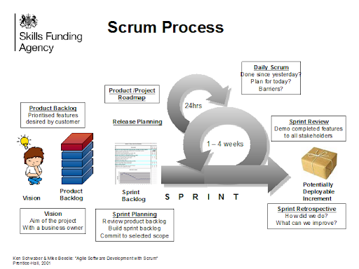
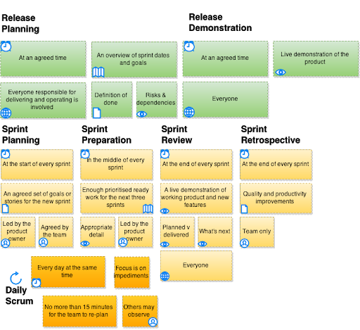
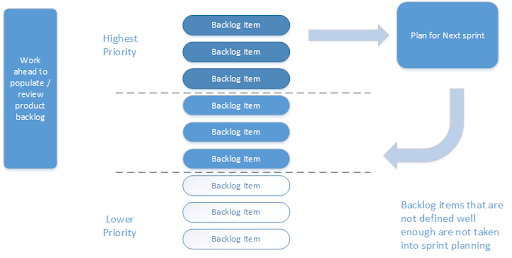
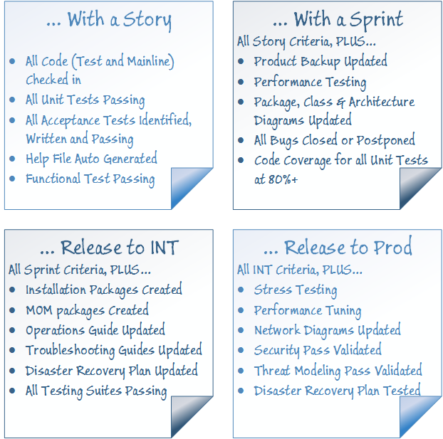

# Agile Delivery

> Three leaders per team to solve problems: Business (PO), Technical (Dev Lead/or Dev Clan Lead) & Agile Coach (DM)
>
> Autonomy with boundaries (autonomy with alignment)
> 
> Make mistakes fast, and fix them

The framework (Figure 1) guides creation of a product, with a focus on value and high visibility of progress. Working from a dynamic list of the most valuable things to do a team uses the framework to bring that product from an idea to life. 

In addition to this process it has proven to be advantageous to hold a preparation meeting mid sprint to assist the product owner to ensure that the product backlog is sufficiently detailed and estimated for the next sprint planning session. This meeting is often referred to as the Look Ahead, Backlog Grooming or Sprint Preparation. 

All work performed needs a set of values as the foundation for the team's processes and interactions. And by embracing these five values, the team makes them even more instrumental to its health and success.

*Focus* - Because we focus on only a few things at a time, we work well together and produce excellent work. We deliver valuable items sooner. 

*Courage* - Because we work as a team, we feel supported and have more resources at our disposal. This gives us the courage to undertake greater challenges. 
Openness

As we work together, we express how we're doing, what's in our way, and our concerns so they can be addressed. 

*Commitment* - Because we have great control over our own destiny, we are more committed to success. 

*Respect* - As we work together, sharing successes and failures, we come to respect each other and to help each other become worthy of respect. 

*Trust* - To truely work as a team each member must be trusted implicitly to make the right decisions and to do the right thing.

# Kanban

Kanban is a set of principles that can be used to view the current process and look to remove the waste identified and so “pull” the work through the process thereby increasing the efficiency of a programme or project.

The first step is to focus on the quality, do everything possible to ensure that the best quality is delivered through the established quality assurance techniques

Map out the current process and make the work in process visible, this is often seen as kanban board on a wall with cards or post its representing work that is being undertaken through the process.
Look to reduce the work in process until the work in progress is successfully being delivered. According to lean Work in Progress is inventory and therefore waste.

Then look to improve the process so that delivery is frequent and measurable. Particularly of interest is the amount of Work in progress at any moment in time and the lead-time from work being requested to being delivered (Definition of done).
Balance the demand against throughput, the ability to deliver. Introduce Work in Progress limits for each stage in the process so that the amount of work in the process can be varied and so balance achieved.

Ensure the backlog of work entering the process is appropriately prioritised so that the next backlog item to be delivered is known and obvious to all.

Continually look for sources of variability in the process and act to reduce or illuminate them so that the project is continually improving how it operates.

# User Stories

Typically user stories are used as backlog items. User stories are an established method of clear communication between the team and the business they describe: who is going to use the product, how will they use the product and what will they do with the product. Stories are normally written on index cards and can be annotated with notes, estimates and any other information that may be useful to the team.

The details of the story should emerge in conversation between the product owner and the business representatives or stakeholders. The story often takes the form AS A ….. I WANT….. SO THAT…… However the more detailed the story, e.g. linking in scenarios of use or storyboards, the easier it will be to understand.

Each user story should have acceptance criteria associated with it. These may be written as closed questions where the answer should be yes or in the form GIVEN…. WHEN…. THEN…

When writing stories remember the INVEST acronym

* *I – Independent:* Try to manage dependencies between stories out. The less dependencies to manage the easier it is.
* *N – Negotiable:* The team should be able to negotiate the user story in terms of it’s priority, selecting a sprint for delivery.
* *V – Valuable:* Each user story should have value associated with it, at least an understanding of the context within which it was created and how it contributes to the overall vision.
* *E – Estimable:* Each story should be estimated relative to the other user stories. Whether this is in T-Shirt Sizing, Fibonacci Sequence or Ideal Days.
* *S – Sized Appropriately:* Ultimately we need user stories that can be delivered within a sprint. If it can not be delivered within a sprint it needs to be broken down further even if dependencies are introduced.
* *T – Testable:* Each story should be testable in that it should have acceptance criteria that can be tested and so demonstrate that the story is complete.

User stories tend to be used for two different purposes. They are used by teams to understand the work to be delivered (promise of a conversation) and demonstrate and measure progress. They are also used to map out and plan the whole of the delivery

# Artifacts

## Potentially Deployable Product Increment

During a sprint or at the end of a sprint the team delivers software that is potentially deployable, a fully integrated shippable subset of the product. If the product owner desires the software could be deployed to production environments.
This is an essential aspect of agile. The completed software is the measure of progress; it has to be complete and proven to be working. If the product owner decides that the software is to be de

## Product Backlog

A product backlog is a list of ideas for the product, in order of priority. The items within a backlog can come from the product owner, team members, or stakeholders. Each backlog item contains a description and an estimate of effort. The product backlog needs to be frequently worked on by the product owner so that the priority items have sufficient detail to be estimated by the team in preparation for sprint planning. The aim is to have sufficient estimated items for two to three sprints of activity. Planning is achieved by measuring the velocity (the amount of work completed within a Sprint) and using this to predict when product backlog items are likely to be completed.

The development team’s work comes from the product backlog, and nowhere else. Every feature, enhancement, bug fix, documentation requirement—every bit of work the team does—comes from a product backlog item. The product backlog may begin as a large or short list. It may be vague or well defined. Typically it begins short and vague and becomes longer and more defined as time goes on. Product backlog items selected for implementation soon will be "refined," which means they will be further clarified, defined, and split into smaller chunks. Though the product owner is responsible for maintaining the product backlog, the development team helps produce and update it.

## Estimation & Velocity

Estimation is achieved using a mechanism called relative estimation, where a suitable story is selected as a reference story and allocated a number of points. Each story is then compared to the reference story and an estimate is derived based on the relative effort between the stories. Double the effort is double the points, half the effort half the points etc.

A team will then track the number of points completed (met definition of done) each sprint. This measured velocity is then used to estimate what stories will be completed within future sprints. _It is important to note that points are unique to each estimating team hence the importance of making teams as consistent as practically possible. It is also worth noting that because points are unique to a particular team and problem domain they should not be used to compare performance of different teams or different projects._

## Sprint Backlog

The detailed plan for development during the next sprint. Backlog items are broken down into tasks and the team plans these tasks into the sprint.
The team displays its plans and progress so that all team members and stakeholders can see what the team is accomplishing.

# Sprint Activities

## Product Backlog Refinement

The product backlog is developed further by adding details to the priority backlog items by splitting the larger items into smaller items that can be relatively estimated by the team and delivered within a sprint. The product owner is ultimately responsible for this activity and should make use of the BA, development and test skills within the team. Often the team will schedule look-a-head meetings to ensure sufficient time is given to estimating and understanding the next set of backlog items.

## Sprint Planning 

Each sprint begins with a time boxed meeting called sprint planning. In this meeting, the team selects and understands the work to be done in the sprint.
The entire team attends the sprint planning meeting. The recommended time for the sprint planning meeting is two hours or less per week of sprint duration. Working from the product backlog, the product owner and the development team members discuss each item and come to a shared understanding of that item and what is required to complete it consistent with the current definition of done. 

* The product owner decides what to do
* Presents "what to do," using the product backlog items
* Answers questions and resolves misunderstandings about the product backlog items

Because the meeting is time boxed, the success of the sprint planning meeting depends on the quality of the product backlog items going into the meeting. This is why product backlog refinement is so important.

The development team then decides how much to take on and how to accomplish it:-
* Considers and discusses product backlog items with the product owner
* Ensures a common understanding of them
* Selects a number of items they forecast they can accomplish
* Creates a sufficiently detailed sprint backlog to be sure they can accomplish the items

Where a team is working with other teams on a service or product the cadence is arranged to ensure whole system integrity. This may mean synchronising your sprints with others and preparing a shared demonstration regularly.

Each team with the guidance of their product owner who is part of the platform layer works through and plans their own sprints by breaking the platform backlog items into user stories and on into tasks to be completed. These are estimated and the team plans how the work will be undertaken and who will be undertaking which activity during the sprint.

For a story to be accepted into a sprint it must be ready with clear acceptance criteria so that everybody understands what is required and it is straightforward to declare the story complete.
The team will decide how it will manage it’s sprint backlog. The team may maintain their plan on a wall along with a board showing the current progress or it may use a tool such as Jira to maintain these two views.

There also needs to be a clear definition of done (See 2.6.1) that is shared between teams. The definition must always include the notion that the product increment is of high enough quality to be shippable. In other words, the product owner could choose to release it immediately. The latest product increment includes the functionality of all previous product increments and is fully tested so that all completed product backlog items continue to work together.

## Daily Stand up

This activity ensures all team members have the opportunity to communicate about the sprint plan and their individual progress with each other on a daily basis. The communication is kept brief with each team member answering three questions:-

* What have they done (with reference to the sprint plan) since the last meeting?
* What (with reference to the sprint plan) are they intending to do next?
* What is preventing or impeding progress?

Team members might ask brief clarifying questions and get brief answers, but they don't go into depth during the daily stand up. Instead, subsets of the development team often meet right after the daily stand up to work on any issues that have come up.

The daily stand up is not a reporting event. It's a communication meeting within the development team that helps ensure that all team members are on the same page and moving forward. Though interested parties are welcome to come and listen to the stand up, only the team members, including the delivery manager and product owner, speak during this meeting. Based on what comes up in the meeting, the development team reorganises the work as needed to accomplish the sprint goal and the product increment.

The meeting should not last more than 15 minutes, any blockers should be captured by the delivery manager so that they can be resolved as quickly as possible.

## Sprint Review

A meeting at the end of the sprint between the team and key stakeholders. The sprint review centres on a demonstration of the deployable software (primary measure of progress) that has been completed during the sprint. It includes a statement of what was planned and what was delivered in the sprint, a statement on whether the team will complete their objectives for the release, a live demonstration of the service and a preview to what may be in the next sprint.

The team should demonstrate the completed backlog items with reference to the wider product goals to the stakeholder community prompting feedback. The feedback given should be captured and used by the product owner and the team to improve and change the product backlog.

When scaling these statements may need to be formalised into sprint reports to help facilitate reporting of progress to senior managers and stakeholders.

## Sprint Retrospective 

At the end of each sprint, the team meets for the sprint retrospective, which is again time-boxed for about an hour per week of the sprint duration. During the sprint retrospective, the team members review how the process went, including the interpersonal relationships and the tools used. They talk about what went well and not so well, and they identify potential improvements.

Then they come up with a plan for improving these aspects in the future. Remaining true to the framework, the team improves its own process versus relying on others to provide direction.

When scaling Agile it is also desirable to run a retrospective involving the whole platform at the end of a release.

# Definition of Done

This is a clear statement of done, an enabler that allows people to confidently say “This is done.” It is important to know what constitutes done as it provides the measure of progress and creates trust between all stakeholders including the business. Teams normally establish a definition of done at the start of the project and it should cover:

* How do we know a feature is complete
* How do we know the code is complete
* What level of approval is required from the product owner
* How do we know that what has been built is production ready

In reality the platform organisation will be working towards a shippable state. Consequently there will be different definition of done at various levels, for example: 

* Definition of done for a feature (story or product backlog item)
* Definition of done for a sprint (collection of features developed within a sprint)
* Definition of done for integration environment (features released for integration testing)
* Definition of done for a release (potentially shippable state)

It is important that the definition of done is not aspirational, it should be based on reality and achievable. Teams should check at the release and sprint planning meetings that the definition of done is achievable and modify them accordingly.
