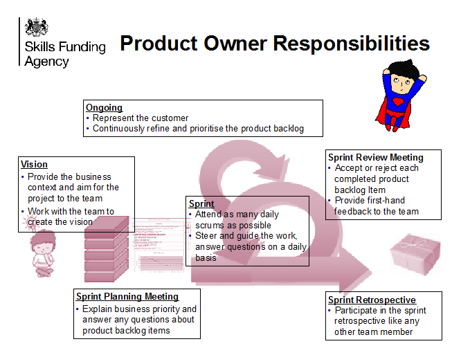

# Roles

## Product Owner

The product owner decides what the priorities are, based on real business value. The product owner is part of the team and guides development, usually utilising a prioritised product backlog. They have requisite domain knowledge and are recognised as the team level decision maker for the business and is the interface between the stakeholders and the delivery team. Figure 3 describes the product owner’s responsibilities within the framework. A good product owner has the following characteristics:

* Available when needed
* Understands customer needs thoroughly
* Empowered with authority to make decisions and held accountable for those decision
* Is able to create and communicate the product vision
* Makes decisions, is decisive and knows when to say no
* Has good working relationships with the stakeholders
* Has good working relationships with the team
* Understands value creation
* Leader and facilitator 

Please note that a lot is expected from the product owner and as an individual from the business they are likely to have other responsibilities. Therefore the product owner needs to be provided with sufficient BA support and training

## Delivery Manager

The delivery manager’s focus is to ensure the team are working effectively, efficiently and are not slowed down by outside influences or impediments. They act as facilitators and coaches to increase team performance and ensure visibility to all involved parties. The delivery manager:

* Establishes delivery team practices and rules
* Supports the team in delivery, inspection and adaptation
* Protects the team from distractions and helps remove obstacles
* Acts as interface between the management and the project team
* Educates the team, the customer and the company about Agile
* Ensures that all standard Agile practices are followed
* Helps the team remove obstacles and problems (“impediments")
* Facilitates interactions within the team and between the team and the customer
* Protects the team from outside disruptions or threat
* Helps the team and the customer to improve the effectiveness of their practices
* Helps the team and the customer to face and resolve difficult or uncomfortable issues

## Traits of an effective delivery manager

* Highly committed to the success of the team
* Good people skills
* Good communication skills
* Observant, good listener
* Courageous mind-set
* Proactive, helpful personality
* Technical expertise helpful but not mandatory

## Delivery Team

All team members are responsible for planning, design, development, quality assurance and continuous improvement of the product. They take their direction from the product owner. Role titles include user research, architect, designer, developer and tester. The team should be cross-functional, self organising, full time and contain all the capabilities needed to deliver the product. Team members:

* Forecast work to be completed within a sprint
* Do whatever is needed to meet the commitment
* Demonstrate iteration output to product owner, users and stakeholders
* Take ownership of all the work the team commits to
* Follow up actions from the sprint retrospectives, look to continually improve
* Meet with product owner, users and stakeholders frequently to clarify tasks and monitor progress
* Value face to face communication
* Manage environments to promote communication and teamwork
* Take part in the daily stand-ups
* Bring challenges into the open, not sweeping them under the carpet
* Identify impediments and share them with the team
* Solve problems rather than blame others
* Ask for assistance or guidance when required
* Aware of what the other team members are doing
* Help other team members, professionally and personally 
