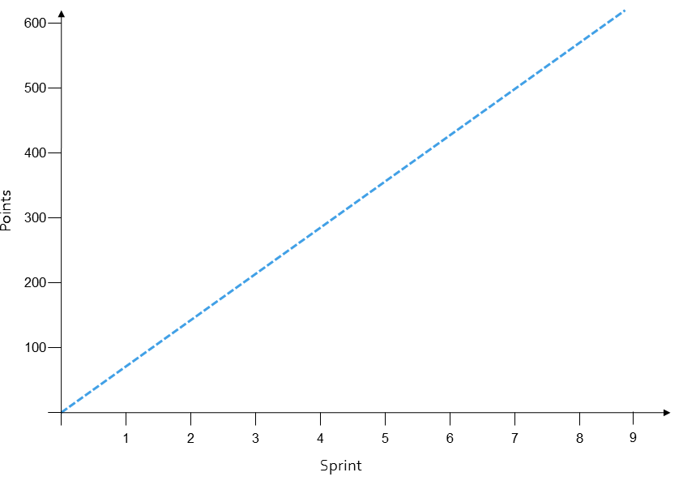

# Scaling Agile

> Read the [Spotify Case Study](spotifycasestudy.md) to see how they are managing to scale Agile practices
  
There are two ​methods and roles used when scaling and coordinating multiple teams

## Creating a Backlog

The strategy and portfolio layers are where ideas are formulated into portfolios and projects. Projects during initiation should establish a vision and the initial roadmap.

## Vision and Roadmap

The vision for a project needs to be both compelling and shared with the whole organisation. Every decision made at all levels of the organisation will be made in light of this vision. The two methods6 shown in Figure 6 are possible quick ways of creating and sharing visions amongst the platform organisation.

The elevator pitch is a well-known technique for creating a sales pitch for a product that can be delivered in a compelling way in under two minutes. The time it takes a lift to take you from the ground floor to the top of a typical office building.

The overall vision is discussed in a ten minute presentation by a senior product owner. The platform organisation then splits into teams – preferably with people they do not normally work with and spend 20 to 30 minutes developing an elevator pitch for the vision.

Each team then present back their pitch. (two minutes per team)

An alternative technique is a product box; where the team having heard the vision spend 20 to 30 minutes designing suitable packaging for the product to go on a supermarket shelf. The packaging describes the product including a logo, key selling features, a tagline, list of features, operating requirements etc. The teams present back and will need five to ten minutes per presentation.

By running these exercises the vision is presented and each individual has time to consider that vision and reflect their understanding of the vision back thereby demonstrating understanding and giving feedback. 

## Backlog Refinement

Commonly the first step is to find out who the users are and create Personas. Then find out what motivates the personas and their goals. Then create scenarios and storyboards that describe how these goals will be accomplished.

Design the new solution and create the backlog so that these personas meet their goals in the smoothest way possible thus completing all the tasks (scenarios) they need to do.

The platform backlog should resemble a tree or map. There are no rules in forming these trees and what is used as levels depends on the problem being solved. Figure 7 shows a possible breakdown with personas identified at the top, the persona’s goals the next level down, epics, themes and then user stories.

Creating the user story map can be done through a number of workshops; the backlog can then be maintained and reviewed during a release. The backlog allows the project to direct the development effort at the highest priority activities and so ensure that the work directly adds value to meet the objectives and vision. 

User Story Tree or Map

The platform backlog must plan sufficiently ahead so that the teams have enough prioritised and ready user stories for the next two to three sprints. If a team’s planning horizon falls below two Sprints then there is the danger of missing key dependencies between teams, failing to have stories ready in time for the start of sprint or allowing stories that are not developer ready into a sprint. This in turn disrupts the productivity of the sprint and decreases velocity and reduces the amount of working software produced. If the team planning horizon increases beyond three sprints then there is a risk of making user stories developer ready that are not yet required and so increasing the work in progress and potentially wasted effort on detailing un-needed stories.

Product backlog items are often large and general in nature, and they can come and go as priorities change. Because of this fluid environment, product backlog refinement is an ongoing activity throughout a project. When you refine the product backlog, you:

* Confirm the order of the product backlog items.
* Remove or demote items that no longer seem important.
* Add or promote items that come up or become more important.
* Split larger items into smaller items.
* Merge smaller items into larger items.
* Estimate items.
* Identify which items are sprint-ready.

Product backlog refinement is an excellent way to prepare for upcoming sprints. During this process, you give special attention to selecting items coming up for the next sprint. Things to consider include:

* Each item for the sprint should represent an increment of "business value."
* The development team needs to be able to build each item within a single sprint.
* Both the stakeholders and the entire team need to be clear on what is intended.
* Depending on the nature of the product, other skills and inputs may be needed. That's why product backlog refinement is really a responsibility of all team members, not just the product owner.

## Planning

In building the backlog seek to build a skeleton or framework that can be used to walk through the product to provide the context within which user stories are being built.

This can be captured on cards and displayed permanently on a prominent wall and become the roadmap for the platform as shown in Figure 9. The yellow card is the vision that has been broken down into a number of areas on blue cards; these in turn have been split into Epic level user stories on purple cards. On this example dependencies between backlog items have been displayed using red arrows and teams have been identified with coloured circles. 

The purple backlog items on the chart will need to be broken down further into user stories and tasks by the team. This would form the team’s product backlog for the release and the team’s release plan and sprint plans as in Figure 10. The epic level stories are broken down by the team to user stories on pink cards and into tasks on green cards.

## Daily Standup

The development team uses the daily stand up to ensure that they are on track for that sprint. They hold the meeting at the same time and place every day. The meeting should be short and time boxed for a maximum of 15 minutes.

With multiple teams in addition to the daily stand up there will be a regular scrum-of-scrums to facilitate the same form of communication between teams. This meeting includes a representative from each team takes place once or twice a week and should last about 30 mins

## The Agile Baseline

The baseline is created during an initiation (discovery) period and comprises five high-level areas: Objectives, Solution, Uncertainty, Plan, and Standards. Typically these will be distilled into one or more documents including the backlog, and the overarching plan. 

### Objectives 

Clear objectives are important within Agile projects as they are actively used throughout the project to prioritise work and enable effective decision-making. Agile projects explicitly do not completely and tie down the final solution from the beginning, so the objectives will be regularly referenced throughout the project when making decisions and prioritising work. Therefore, as a key foundation of an Agile project, the objectives will need to be explored in detail and properly validated during project initiation.

Some project objectives should be expressed in measurable terms, i.e. as KPIs (Key Performance Indicators). KPIs can be both objective measures (e.g. number of items sold, web visits) and subjective measures (e.g. brand recognition, user experience). 

Ideally, all stakeholders should be involved in setting the objectives, including internal stakeholders such as infrastructure, architecture and operations. 

To achieve a thorough understanding of the objectives, the relative importance of each objective should be defined. This is achieved by either putting the objectives in priority order or by weighting each objective. 

### Solution 

Agile projects do not define the complete solution, but that does not mean to say that there is no information at all about the expected solution. Any expectations or constraints about the solution should be included in the baseline. Any vision of what the solution might be, or solution-based thinking can be included, but it should be clear that these are not formally part of the baseline – i.e. if they subsequently change there is no requirement for change control. 

Getting the right level of detail for the Solution is a key skill. Too much detail and the project will be overly constrained and suffer from unnecessary change overhead. Too little detail and there is a danger of expectations not being met. 

During the earlier stages of a project a high level summary is required to properly explain the intent, a free text document can be used for this purpose. Once created, a Product Backlog is effectively a vision of the solution. If the project is at a point where the product backlog exists and effectively describes the vision of the solution then it is sufficient on its own. 

### Uncertainty 

At the start of a project there is typically the most uncertainty in the areas of requirements, the solution, costs and how much of the intended benefit will be achieved. 

When constructing the baseline it is important to understand the nature of uncertainty. To paraphrase Donald Rumsfeld, it is necessary to evaluate the “known un-knows”, and ensure that the “un-known un-kn0wns” will not be detrimental to the project.

A traditional project does not need to explicitly address on-going uncertainty resolution because it is implicit in the process that 100% of design is completed as part of initiation (i.e. prior to build through a series of more detailed design phases). An erroneous interpretation of Agile goes to the other extreme and implicitly advocates zero design before the start of build. Both approaches are over-simplifications, adding unnecessary inefficiency and risk to the project. The optimum approach is to consider what needs to be resolved when, and how it ties into the stories on the product backlog. 

It is therefore essential to identify and evaluate the key uncertainties. Planning uncertainty explicitly allows:-

* The ability to make a governance-level decision as to whether the amount of early design is too much or too little. This will impact and potentially delay the start of build.
* The ability to ensure that key design areas have been properly considered and factored into the project plan.
* The ability to track the design actions throughout the project.
  
Some uncertainties are similar to risks: what are the big problem areas going to be? However, not all uncertainties are necessarily risks - they may just be items not known currently that one can confidently predict will be known by the time it is necessary. It should also be noted that while resolving uncertainty too late can increase risk, it is also true that resolving uncertainty too early can increase risk, particularly where it involves making unsubstantiated assumptions - so uncertainty and risk are not synonymous.

Potential areas for uncertainty, map (unsurprisingly) onto the traditional areas of design: requirements, functionality, non-functional and technical solution.

Different aspects of uncertainty will have different impacts on the project. For example, not knowing what programming language to use has a different effect on the project than not knowing what colour a ‘call to action’ button on one screen will be. Therefore, it is key to identify those areas of uncertainty that potentially have the largest impact on a project, and at what point. In Agile projects, it is important to determine what can be delivered early to reduce or remove these uncertainties (e.g. feedback loops can help with some areas of uncertainty).

During initiation it is necessary to evaluate uncertainty and make explicit when and how uncertainty will be resolved. Within the baseline uncertainty resolution will be planned in one of three ways, within the:-

* Backlog – e.g. a particular story requires a distinct amount of analysis effort, but this does not need to be undertaken until the story is ready to be played.
* Overarching Plan – e.g. user-needs analysis, access to a specific domain expert during a period, usability lab tests, external penetration testing.
* Sprint Process – analysis, design, engagement with experts etc. may be included as specific operating procedures within the Sprint process.

Planning uncertainty resolution will identify which elements of design must be addressed during initiation. The challenge as always is to only undertake what is absolutely required. Establishing a ‘sufficiency’ of design during initiation will have the following benefits.

Establish a high level architecture producing an initial level of understanding and clarity.
Reduce the risk of substantial rework.
Help identify high level technical risks and new uncertainties.

Creating too much up front design will potentially have some or all of the following effects.

* Delay the start of development.
* Waste due to redesign as requirements are clarified later in the project.
* Waste due to features being deprioritised and never built.
* Sub optimal designs due to early decisions made without the benefits of project 
experience. 

Importantly, understanding uncertainty provides a mechanism for the perennial Agile question, “how much analysis is required?”. Correct understanding and management of uncertainty will not only answer the question “how much?” but also “when?”. 

The Product Backlog (discussed below) is a list of Stories to be implemented in priority order with relative estimates. If there are estimates for all the work that needs to be done, properly taking into account the uncertainty present through the use of contingent estimates, then the Product Backlog is fundamentally a plan. With a resource profile and a velocity profile the complete sprint for any story can be determined automatically. Obviously this will change as the product backlog is refined. 

Combined with the backlog is the Incremental Plan (see below). It provides a big picture view of the project to support communication and governance.

The product Backlog is not the whole plan of work. There may be other work which is not part of the system functionality. This can be included in an over-arching plan which can take the form of a traditional Gantt chart (if there are significant logistical issues) or a simple list of activities. Note that a list of activities is not the same as a product backlog, although it can be used in a similar way if the tasks are not interdependent.

### Standards

Standards are simply a low-cost way of repeating elements across multiple baselines. By moving them out into a separate document they can be referred to multiple times. Typical examples include testing strategy, deployment, coding etc.

Additionally, if the standard changes, the baseline itself does not need to change. 

### The Product Backlog

The product backlog is intended to be a dynamic document, continuously refined as the project progresses. However, at the end of project initiation a baseline version is required. This version should be complete, in that it includes a baseline statement of the total volume of work, and will be subject to appropriate ongoing baseline management. As a plan, the Product Backlog consists of the following inputs: 

* A list of stories
* A relative estimate for each story
* A start date for Sprint 1
* A planned velocity profile, based on the resource plan
* The duration of each sprint

Once complete it is possible to assign stories to sprints, and to calculate an estimated date for which each story will be completed.
It is essential that the latter be automatically derived (e.g. within a simple backlog management tool or spreadsheet). In this way there is no overhead handling simple changes to the product backlog, such as changing priorities, swapping stories, or changing estimates.
A good product backlog will have the following characteristics:-

* Each item on the product backlog has business value in its own right or adds capability
* At any time, it is complete and in priority order
* It is based on scenarios (user stories) and not use cases
* Each story can be tested by a user when released
* It will have a least 2 functional milestones
* Ideally, no item that is deemed ready to develop will be expected to take more than 3 
days of effort to complete
* There should be very few dependencies between stories
* Incremental Delivery Strategy

A key benefit of Agile is that the project consists of a continuous flow of deliverables (rather than a single one-off deliverable). The Incremental Delivery Strategy is expression of the high-level thinking about how best to order the deliverables so as to get maximum benefit from the incremental approach.

The incremental delivery strategy (or incremental plan) is an important artefact as it provides a big picture view of the project and gives shape to the backlog (see fig). Without it the backlog is simply a list of stories and can be somewhat impenetrable to those not involved directly in the project. 

The Incremental Delivery Strategy will be derived from and will validate the project objectives, adding a time dimension to those objectives. It also examines the impact of possible solutions on the ability to derive early value.

One part of the Incremental Delivery Strategy is a Release Plan, identifying headline opportunities for releasing usable solutions or part-solutions, which will deliver against the project objectives and provide feedback to be factored into the on-going project. However, the Incremental Delivery Strategy also needs to look at the reasons for delivering in a particular order, even when nothing is going to be fully deployed. For example, to provide something which can be tested in order to illicit user feedback. 

The Incremental Delivery Strategy is represented as a series of Functional Milestones, together with the arguments for what is included in each milestone, what each achieves, and why they are in that order. A "Functional Milestone" is simply a point at which something significant has been achieved as a result of the functionality implemented so far. It can be viewed as a line drawn through the Product Backlog. 

The Functional Milestones are a key element of reporting.

A project should always have at least two Functional Milestones:
Minumum Functionality – the minimum set that has to be delivered for the project to be considered a success (MVP).

Full functionality – everything that had been planned to be delivered for the original budget.

Identifying the minimum functional milestone is important because everything in the product backlog after this milestone can be considered as negotiable scope. This should be about 30% of the product backlog. If it is lower than 30%, this implies a need for additional contingency.

It is beneficial to have additional milestones as these not only help in the reporting context, but also in the prioritisation of stories.

A product backlog will often have a functional milestone for the first set of functionality that can be tested by users. Some product backlogs have an even earlier functional milestone – this can be a set of functionality that is testable but may not be user testable (e.g. check information is added to a database).

*Estimation*

Once the product backlog has been sufficiently developed, in that the breadth of the project is understood and one or two areas have been explored in detail. This will provide the basis for estimation of the project timeline, costs and ultimately commitment. The process of project estimation requires that each story be estimated, the process by which this is achieved follows the Agile standard, but is then refined to deal with real-world scenarios.

Estimation is achieved using a mechanism called relative estimation, where a suitable story is selected as a reference story and allocated a number of points. Each story is then compared to the reference story and an estimate is derived based on the relative effort between the stories. Double the effort is double the points, half the effort half the points etc. 

### Initial Calibration 

Calibration is the correlation of estimation points to man-days. Once the project is in progress the velocity is used for the forecast, and the calibration is irrelevant. Initially though, no actual velocity is available and a calibration is required to determine the effort and time requirements.

To generate a calibration, perform man-day estimates of sample stories to determine an initial mapping of estimation points to (development) man-days. Other resources such as testing are typically determined as a ratio to development resources and from the cumulative estimates decide on the total points to be delivered.

If planning multiple teams, use the calculation summary statistics displayed below the estimates to determine the overall resource split between teams. Note that this calculation is based on all stories. If there are stories not intended to be delivered that will have a significant effect on the split then temporarily set the estimate for these stories to zero.

Use the calibration to calculate the total amount of resource required to achieve the baseline number of points, balancing objectives with resource and time constraints to determine the number of sprints required.

Determine the resource weighting for each sprint, based on expected variations in assigned resources, productivity, holidays, etc. and use the Calibration template to determine the Baseline Velocity Profile.

### Velocity Profile 

A velocity profile is a prediction of the number of points that can be delivered over the course of the project.

The standard approach within Agile is to assume a linear profile i.e. that the progress will remain constant throughout delivery (see fig). This, of course, does not reflect reality, and can negatively impact the project. For example it is very common for initial sprints to be less productive whilst the team becomes acquainted with the context, the problem and each other. If at the end of the third sprint the team is reporting 50% progress against plan, then this is probably not a good thing. The ideal plan will recognise that this was to be expected. 

Determining an initial calibration will indicate the number of points expected in the first sprint, however building a longer term plan will require the additional factors to be taken into account that will result in the velocity of sprints be effected in a positive or negative way. Examples of these factors are: 

* Initial ramp-up
* Changes in team staffing levels
* Impact of new staff of team performance
* Holidays (e.g. Easter Bank Holidayswill typically result in a minimum of 20% drop in velocity over a 2-week Sprint)

View of team efficiency based on cohesiveness
These factors can be applied as percentages to the plan and compounded, for example:

|Sprint|0|1|2|3|4|5|6|7|8|
|------|---|---|---|---|---|---|---|---|---|
|Max Velocity per Sprint|118|118|118|118|118|118|118|118|118|
|Efficiency|0|30%|40%|50%|60%|70%|80%|90%|100%|
|Holidays|0|0|0|0|-10%|-40%|-5%|0|0|
|Planned Velocity per Sprint|0|35.4|47.2|59|59|29.5|106.2|118|118|
|Planned Velocity|0|35.4|82.6|141.6|200.6|230.1|336.3|454.3|572|

By applying the factors identified that will affect velocity, a profile over time can be calculated.

This will result in a more realistic projection of team performance. For example, in the chart above, sprint 5 could represent the end of August, which invariably includes a number of holidays and one Bank Holiday. 

### Estimating Epic or Large Stories 

Every story in the product backlog must be estimated or the baseline cannot be created. This will require some large stories or epics to be estimated where there is still significant amounts of outstanding uncertainty that can have a substantial impact on the amount of effort required to deliver the story. Typically, this can be that the business or technical design is currently unknown.

One of the ways to approach this is to accept that the estimate will be subject to a variation based on the uncertainty. Similar to traditional projects, contingency can be applied to provide resources to counter the impact of change, and uncertainty resolution is one of the sources of change. In other words, the contingency reserve is intended to support variation in estimates for epic stories.

However, relying on contingency as a reserve is a passive approach and an active approach may be more appropriate if the uncertainties involved are tangible. 

### Making a Commitment 

It is important to recognise that estimates and the resulting plan, even one that applies a variable velocity profile, are not the same as commitment. Confusing the two can be dangerous. 

Relative estimates represent the best case scenario and do not hold any contingency, and without some level of contingency it is near impossible to make a commitment (and meet it).

If the project is required to commit to deliveries of functionality against dates and/or within budgets then commitment management must be addressed within the initiation phase.

## Governance

### Objectives

The main objective of a governance structure is to ensure that stakeholders receive the appropriate level of project insight to enable them to apply the appropriate level of influence. 

Getting the understanding of ‘appropriate’ right is a key objective in Agile projects. It is a pervasive challenge that affects almost every level of Agile development from determining what a ‘sufficient’ level of initial design is, to determining the detail required by each story. The more invested in pre-decision activity, the more expensive the decision. However, key decisions may have significant impact and thus may need some attention.

Objectives can be described as follows:

* Facilitate effective distribution of insight (Reporting)
* Stakeholders must be informed of issues that need their attention
* The level of detail must be appropriate to their role
* Only report actionable insight (Exception based reporting)
* Facilitate the delivery of informed influence (Decision Making)
* Ensure all relevant stakeholders are represented in each decision
* Ensure that decisions taken are appropriate at the time of tasking
* Traceability
* All decisions must be recorded with appropriate attributes
* Escalation/delegation model
* Ensure the right stakeholders make the decision 

### Impact of Agile 

Agile programmes, projects and work streams have a number of specific differences when compared to the more traditional waterfall style approach. These are discussed below: 

More Decisions are Required

The first is that in a traditional work structure, most of the uncertainty is (in theory) resolved before development of the project starts. This usually takes the form of a comprehensive design stage. The project is baselined at this point, and change control applied. Change is usually resisted from this point as it impacts the delivery plan.

Agile work structures take a different approach predicated on the assumption that resolving too much uncertainty initially is sub-optimal. Some decisions will be made that are ultimately not required as scope changes. This effort is therefore wasted.

Additionally, contextual change will occur over time making the earlier decisions more likely to be sub-optimal and sometimes completely wrong. Therefore, the Agile approach is to undertake uncertainty resolution at the ‘last responsible moment’. This results in an ongoing requirement to manage unresolved uncertainty within the development stages. This in turn results in increased volumes of necessary change to the base-line plan.

The Agile approach seeks early and continuous feedback on project deliverables. Experimentation techniques can be employed to validate assumptions and gain additional clarity of the contextual domain. This can result in significant changes being required in the overall approach being taken and the work may ‘pivot’ in a new direction. The overall result is usually a closer alignment of problem and solution, but it can result in significant change.

Opportunistic change opportunities are openly welcomed. A new benefit or more valuable version of an existing benefit can be identified at any time within the duration of the work. If these new benefit opportunities provide more value than the base-lined benefits, it may be wholly appropriate to accept these changes. Changes of this type range from small ‘tweaks’ to functionality to make them better in some way to opening up entire new opportunities that were previously not targeted.

Agile philosophy accepts that change will occur and quite possibly, in large volumes. The structures, both organisational and technical must be created to be able to cope with this increased volume, efficiently and in a cost effective manner. 

Increased Responsiveness is Required 
Decisions required within the development phase of the work need to be made more rapidly than during analysis style phases of traditional projects, and because of the desire to resolve uncertainty at the ‘last responsible moment’ there is a high probability that an unanswered question will impact the project team. This is a limitation of timely uncertainty management approaches, however its benefits far out-weight this disadvantage, especially if an effective governance structure mitigates the issue by providing fast decisions.

The Agile approach is to target high ‘value’ work as a priority over low value work. If the project is blocked by unanswered questions then the most valuable work will be delayed. In the worst case the project team is idle awaiting direction. If alternative work is found this will occupy the project team but it will be almost be of lower value and thus not a desirable approach to take.

The staffing levels and the associated project cost will usually peak during development. Any delays caused by unanswered decisions will therefore increase costs or result in less functionality being delivered. Preventing blocks to addressing the optimal high value work is a key factor in using development resources effectively. 

In summary, Agile work requires an increased number of ‘timely’ decisions to be made during development so any decision making structure in place must be able to deliver rapid answers to questions posed or suffer the costs in reduced value being delivered over time.

The Opportunity for Direct Engagement 
Agile development seeks early and continues engagement from stakeholders to validate the ongoing investment and to allow influence from stakeholders to help guide the programme to producing a product that is fit for purpose.

This continuous engagement provides a number of specific advantages:-

* Decisions can be made in the current contextual environment, not a projected one.
* Decisions can be made outside formal decision boards if appropriate.
* Progress can be validated on a continuous basis.
Opportunistic change can identified and exploited early if agreed.
* However, there are some additional challenges that this approach creates. 
* Increased challenge of communication.
* On-going time demand on some stakeholders.

### Decision-Making Efficiency

The effectiveness of the governance structure is fundamentally dependent on the efficiency of decision-making. This will always be affected by the size of organisation and degree of direct involvement of the decision-makers, but the mechanisms used to support decision- making and the underlying information flows will also have a major impact.

Quality of Baselines

The definition of what is included in the baseline of the product can make a substantial difference to the number of decisions that have to be made. Agile development refines the product solution over time and additional detail is applied throughout the life of the programme. Adding detail is not a change if it does not change the agreed baseline position. Adding detail ‘below’ the level of the baseline will not require stakeholder input.

For example, if a service is required to provide a user’s contact history and the plan is baselined with detailed screen designs, any change to a screen in any way will invoke change management. If however, the baseline is at the service level, changes to any screen layouts or contents will essentially be adding detail. On the condition that the service level requirements are not compromised there is no change management required.

Establishing the appropriate level to apply the baseline can be a challenge. Too high and excessive variation from expected results can occur. However this is at least partly mitigated though the collaborative approach to product development that is desired. Review of the deliverables throughout its development by stakeholders is actively encouraged though stakeholder participation.

Setting the baseline level too low will control development more closely but result in more decisions requiring change management.
The overall goal is to set the base-line at a level that identifies and manages changes of significance and allows local autonomy to determine the detail.

Empowerment and Delegation of Decision Making 

Allowing decisions to be made at the appropriate level within a governance structure will reduce the requirement to pass decisions to a high level decision body. Decisions will be faster and incur a reduced management overhead.

However, establishing a model to determine where a decision is most appropriate to make can take some time and will require regular reviews of the process. 

Additionally, there needs to be a communication process to identify decisions made. This communication model serves both to inform stakeholders of changes to the baseline as well as allow decisions that have been made to be challenged and revoked if required. 
Informed Decisions 

Delegated decision making creates some additional challenges. For the decision to be informed, other stakeholders outside the immediate decision makers may need to be consulted. If direct stakeholder engagement is supported, paths to this expertise must be made available to the decision makers. If a stakeholder’s view is required, then they must be consulted.

If relevant stakeholders are unavailable then a decision can still be made, but, the chance of it being wrong is increased. In this case the benefits of making the call immediately must be weighed against the risks of the decision being wrong. This risk can be mitigated by integrating the decision into the product with a low cost of change. Thus is if the decision is revoked, the cost is minimised. 

Decision Making Criteria 

It is important to give guidance as to the type of decision that can be made by a level of the governance hierarchy and what needs to be escalated. A set of rules should be established to help identify a decision making boundary, defining if the decision can be resolved locally or must be escalated. This decision making criteria can of course change over time based on the perceived effectiveness of the governance model at any one time. 

Reporting Decisions 

All decisions should be logged for the purpose of audit. A subset of this information should be passed to the next level in the governance hierarchy for ratification. Decisions make can be reviewed and validated as being appropriate.

The criteria used to determine if a decision should be reported should again be reviewed by the higher body. If too much ‘noise’ is deemed to be reported then it is possible that the reporting criteria should be changed to report less of the low impact decisions. 

Revoking Decisions 

If a reported decision is deemed inappropriate it can be revoked, then any work that has progressed based on the decision is potentially wasted as it will have to be ‘undone’.
Additionally the decision making criteria should be reviewed to minimise the chances of future decisions of this type being made at the wrong level.

Escalation by Exception

The overall desire is to make as many decisions as possible at lower levels within the hierarchy as possible and only escalate a decision if absolutely necessary. As a result the desired position to be in is decisions should be escalated as an exception and not as standard. 

Higher level boards should only address decisions that absolutely require the level of authority granted to that board and nothing lower. The reporting of decisions will allow the board to review and revoke as required, in order that control is maintained.

Stakeholder Engagement 

There are a number of differing models that can be used for effective stakeholder engagement. In all cases the objective is to ensure each stakeholder has the opportunity to gain insight into the current status of the project and offer influence where appropriate.

Stakeholders should be listed and then prioritised by ability to impact the project. For each stakeholder, a strategy of engagement can be selected from the following options:-

* Assign to the Project Board - Support with an agent.
* Embed the stakeholder into the project team – Full time secondment may be appropriate.
* Utilise existing organisational structure. If a stakeholder already reports to a governance board member, then the board member can represent this stakeholder.
* Assign as a compliance stakeholder

### Baseline Management (Change Control) 

Change control is typically seen as unnecessary, or even detrimental, on Agile projects – an overhead that the Agile process is explicitly set up to remove. It is often believed (and argued) that an understanding of change can be conveyed and managed through direct communication such as Show and Tell sessions. Whilst this may be appropriate in some cases, in general it is not sufficient and certainly not at scale.

Projects can become insular and project focused, losing sight of the strategic objectives. There are numerous examples of projects driving ahead with developers working collaboratively towards a common goal, making changes on a day-to-day basis in the interests of the project, only suddenly to find that executive stakeholders are extremely uncomfortable with the direction of travel.

It is entirely possible to avoid this problem and properly manage and control change without imposing a significant overhead. The approach to Agile planning and the incremental approach to delivery means that the overhead of the impact analysis of change, is almost completely removed.

However, attention needs to be paid to uncertainty, and expressing baselines in a way that does not constrain the resolution of uncertainty, which also means that the ongoing refinement of detail does not result in an unnecessary constant stream of change.

For example, if a user interface is expressed as a detailed screen image, then a change to the position of a field or icon will be a change. If the interface is described in terms of its business function then layout decisions will not. 

This approach is referred to as Baseline Management – it is concerned with the management and communication of change, not its control (in the traditional sense). 

Effective Baseline Management for Agile projects must meet a number of challenges:-

* It must be rapid and inexpensive to accommodate the potential large volumes of change Agile projects are required to accommodate.
* It should provide adequate control without creating delays resulting in sub optimal performance.
* All stakeholders (including the team) need to be aware of the current project baseline, which will incorporate all accepted change.
* The approach must provide an auditable history of the baseline.
* Baseline management is an essential part of governance. It is very common for Agile projects to become development focused, and for executive stakeholders to feel distanced from the decisions that are made. Whilst low level detail changes are welcome and encouraged, those that affect the wider objectives must be visible to the wider audience and provide the opportunity for intervention. 
  
### Principles 
Baseline management is essentially a matter of creating a baseline and then following explicit procedures when subsequent changes are made. 

Agile explicitly promotes the value of change, and it is therefore a prerequisite that Baseline Management in an Agile context has low overheads and does not create barriers to change. There are three ways that the overheads are minimised:-

* The time and effort for performing the impact analysis per change is reduced. In a non- Agile world all parts of the delivery are in some intermediate state of completion. It is therefore necessary to look into the detail to fully understand the impact. On an Agile project only a small number of stories are in play, so the impact analysis only needs to look at the big picture.
* The baseline includes only those elements which impact the wider context. Traditional change control tends to assume that all statements in the design are automatically part of the baseline. By removing the low impact detail from the baseline definition, change can occur at this level without having to invoke Baseline Management.
* Local autonomy within the development team to make as many change decisions as possible without having to resort to a change board or other higher authority. This is balanced by all decisions being reported to the higher authority for validation post decision.
* Working in an Agile way means that change should be easier to accommodate (e.g. by removing fixed-scope “contracts” for individual pieces of work, estimating per-story, promoting continuous review etc.). However, it does not follow that change should be uncontrolled. An appropriate change control process should achieve the following:-

* Decisions with an impact on the final deliverable are recorded such that an audit trail exists. This is appropriate where there are contractual conditions and service-level criteria to be evaluated against. It is also appropriate for internal projects, where final delivery needs to be planned and not simply arrived at
* Parties not involved in day-to-day decisions receive appropriate communication about changes to plans and expectations
* The possibility that inappropriate behaviour or lack of understanding causes undesirable or unexpected consequences on the overall plan should be removed (e.g. through uncontrolled effort-creep on an individual story).

It also needs to be recognised by all parties involved that Baseline Management is not a negotiation process. There should be no value in attempting to argue that “it isn’t a change because it was always part of the original intent”. It makes no useful difference if an estimate changes because of a change in the intention, because the developer did not understand the intent properly, or the business representative did not understand the proposed solution – in all cases the underlying problem should be addressed through improved behaviours and communication, not through apportioning responsibility. 
  
### Baseline Management 

Baseline Management occurs at three distinct levels:-

* Per story: any substantive change to an individual Story is formally controlled. This includes changes to the estimate, or to the solution if it has a wider impact such as achieving the intended value, compliance with standards (e.g. architectural), or impact on dependencies.
* Per Release: where the specific stories planned to be included in a Release change.
* Per Project: where the specific stories planned to be implemented change, or the release within which those stories are planned changes.

Baseline Management starts by establishing (and maintaining) a baseline from which change is determined. The baselines in question are:-

* Release: the baseline Release Plan for the next release.
* Project: the baseline Product Backlog, incorporated into the Baseline.
* Story: stories are effectively base lined from the point where the first delivery estimate is produced 


### Types of Change 

Change can come from a number of different sources, but these can be summarised as follows:

* Uncertainty resolution – When uncertainties are resolved there is a probability that additional effort may be needed to implement the resolution than was originally budgeted for. As Agile projects accept a higher level of uncertainty into the development stages than more traditional methods, there is a potential for higher levels of additional resultant work
* Uncertainty resolution is usually identified by work undertaken within the Analysis and Design stream, which occurs before the story is played. However it is possible to identify this during play where an estimate doesn’t deliver in reality. This will usually result in an estimate for a story increasing. If the estimate moves above the triggering threshold, then Baseline Management will be invoked
* Innovation – Opportunities seen during the project or on work stream tasks that can deliver additional business benefits. This could be new objectives or refinement of work delivered to date
Innovation usually represents additional functionality or changes to closed stories. As a result, innovation type changes usually result in the creation of new stories to be prioritised as any other story would
* Discovery – As the work unfolds, investigating the detail can expose work that was not planned for. Incomplete business flows; unknown requirements and unidentified stakeholders all add work to the project or product work stream that was not planned for
* Discovery usually results in a story becoming larger or new stories being created. In most cases this will invoke change control.
* Strategic Change – The very nature of the project is altered by a high level decision. This is usually extremely obvious and may result in re-planning and re-base lining
  
### Reporting Triggers

Changes are effectively “decisions”. Traditional Change Control systems require a formal request in order to initiate work to define the impact. When working in an Agile way the impact is often self-evident, e.g. swapping a story of 10 points for 2 stories of 5 points has no impact on the final delivery. In this case the decision can be made immediately.

In other cases there may be knock-on effects, or changes which require stories to be estimated or re-estimated. In general, time to estimate new stories should be built into the team process and planned velocity, rather than managed.

The formal process therefore allows for immediate decisions, but requires that decisions are logged and communicated. Sometimes immediate decisions will be made on a risk basis i.e. it is 90% likely that X is the case, and delay would have a negative impact, so progress assuming X is true”. Sometimes the wider communication with the Change Control process will result in a reversal of a decision. The balance of moving forward versus waiting for decisions needs to be reviewed continuously.

### Decision Making at the Appropriate Level

The person making the change request will review the escalation criteria and establish at what level in the governance hierarchy the change should be authorised at. If it is established that the change can be authorised at the level submitted, then the appropriate decision making body at that level of the governance hierarchy can validate the request immediately. The change log is then updated to record the change.

If it is established that the decision needs to be escalated then the decision will be passed up to the appropriate level via governance reporting mechanisms for a decision to be made. The change log is updated to provide enough information for the change to be evaluated by the decision body the change has been escalated too.

In most cases the information added to the change log as described below in Logging Change will be sufficient. In the case of significant changes requiring supporting information of any kind, then the log can be supplemented with any materials required. These should be suitably labelled to identify them with the change request and stored on the shared drive.

### Post Decision Review 

Most change requests even if acted on locally, will be reported to the next level of the governance hierarchy. If the higher level body deems the decision to be wrong, it can be overridden and any action taken or to be taken reversed or cancelled. 

Obviously, backing out a decision is more expensive than getting the decision right first time. In the case of a decision being overridden, the escalation criteria should be reviewed. 

### Change or Additional Detail? 

Agile projects add detail to stories and designs as the development continues. As a result there is a constant level of ‘change’ to stories plans and supporting materials. However these are not necessarily ‘change’ in the traditional sense and governance of this may not be required. 

This procedure covers change that has a tangible effect on a project or work stream. A tangible effect is something that alters the current understanding of one or more of the following:-

* Costs (Resources, story points, time)
* Delivered business functionality
* Quality
* Delivery milestones
* Adding, removing or changing details of work that doesn’t impact one or more of these is deemed part of the agile working process and will not be affected by this change control mechanism.

### Reporting

Reporting change is an independent process to making decisions on change. All changes should be logged in a central change repository. The specific information logged will depend on the change made but the following basic information should be logged:

* Date change made
* Decision made
* Authorising body 

Higher governance tiers will need to see the appropriate level of detail to help determine which decisions made require post-decision reviews and which can be accepted without inspection.

Determining the appropriate levels of change reporting will be something that evolves over time and it is suggested that initially all change is reported with a view of identifying reporting escalation criteria during the first few reporting cycles. 

### Decision Making 

Decisions within an Agile project should take place as close to the delivery teams as practically possible. However some form of command and control needs to be maintained especially in a scaled environment. It is essential that all understand what decisions can be made within components of the organisation and that decisions are communicated so that the whole organisation can have sight of them. 

This needs to be achieved with the minimum bureaucracy and effort.

The vast majority of decisions should be made within the teams. A mechanism should exist to empower the delivery teams to make decisions and that the decisions can be reviewed, after the event, by the appropriate accountable individuals. In so doing the platform leadership can help assure decision making and if necessary alter where decisions are being made.

This is achieved by stating where changes or decisions concerning those artefacts should be taken. This statement is then used to enable the decision process as detailed:

## Collaborative Governance 

Agile promotes the use of effective collaboration, particularly collaboration between the Delivery Team and the Customer. The simplest possible governance model is therefore one where collaboration provides a natural means of insight and influence on the part of the Customer. This, for example, is incorporated into the role of the Product Owner. The argument is that a representative of the business has a deep understanding of the project, and is directly driving what the project does, so governance is occurring by default.

This model can be sufficient for simple, small projects within organisations. However, this model does not scale well and is not a universal model for governance.

This argument confuses two concepts which should be kept distinct:-
The boundary between organisational units such as “business” and “IT”
The boundaries of delegation, i.e. between customer and delivery
The fact that the Product Owner belongs to the business does not automatically place them on the customer side of the delegation boundary. It is better to consider them as part of the Delivery Team. 

Regardless of the degree of collaboration, there will normally be governance stakeholders who are not directly involved at the detailed level. Given the efficiency objectives for governance, collaboration is not necessarily an efficient model because it requires the involvement of all participants at a low level of detail. This can be a poor use of stakeholder resources. For external stakeholders it is important to define interactions which are at the optimal level of detail. 

### Project Board

In a traditional project the Project Board is often the primary point of influence, and there can therefore be a tendency to try and include all interested stakeholders on the board. As the size of the board increases the efficiency and effectiveness decreases.

A key difference between Agile and traditional projects is that the detail of the solution is resolved collaboratively as part of the on-going process. The primary opportunity for influence is therefore through different mechanisms than the board. This provides an opportunity to make the board smaller and more focussed. It also presents a challenge in that the results of direct stakeholder engagement need to be properly governed to ensure the project remains focused on its key objectives. 

The delivery team engages on a continuous basis with Agents representing governance board members. Agents may be embedded directly in the team (such as a Product Owner, or subject-matter-experts assigned to the project) or more loosely engaged in the process, such as a business representative who attend demonstrations and feedback sessions. Agents can be thought of as champions for their respective Board Member.

For example the Lead Business Representative’s Agent could be regarded as the “Function” (or “Value”) Champion, and those representing a Technical Authority as a “Technical Champion”. The Delivery Manager is therefore the Delivery Champion.

These roles are referred to as “agents” because they are acting as the representative of a board member in the regular cycles of the project. 

It is expected that there are direct lines of engagement between agent and board member through the normal structures of the organisation. This mechanism is important in that it removes the need to rely on board meetings for decisions occurring at a detailed level. It also provides a route for board members to exercise influence outside of the formal structures. As stated above, it is imperative that the change management process can detect and escalate inappropriate uses of this influence. 

Every board member must have at least one agent engaged with the project, and every agent must be represented by a board member. The latter ensures that there is an appropriate route for escalation of issues, particular issues involving relative priorities between different board members with potentially different objectives.

This model means that governance stakeholders do not need to sit on the board to achieve their objectives, but can act as an agent, or engage with an existing agent.

The project boards’ key roles are:-

* To make decisions on strategic or significant issues
* Cross-stakeholder decisions - balancing the objectives of the different represented parties. To achieve this the board should ideally consist of members with equal authority
*Monitoring decisions made by the delivery team, and revoke if required, as part of the change management process

The intended benefit is to reduce the dependence of the project on the frequency of board meetings. The model is not to take important decisions to the board meeting and wait for a response. The correct model is to work through the participants to get the required decisions. The board can ratify these afterwards. The board is only an essential part of the process if there is a need to escalate the balancing of different parties’ objectives or for major substantive changes in the terms of the project.

Any influence from the board member that results in any change is subject to the standard decision making rules. If the decision is within the mandate of the team to decide then the change can be requested by the agent and the work can progress if agreed. If the change is outside the mandate of the team to decide, it will be escalated for board ratification.

Any decisions made on behalf of the board member should be reported back to the full board for review, assuming they meet the reporting criteria. This model prevents any board member from using his or her agent to gain inappropriate levels of influence on the project outside of the control of the board. Additionally, it supports influence originating from stakeholders who are not board members while maintaining the appropriate level of control by the board.

An agent is not necessarily a full time position. A team member can take on several agent roles as well as contribute to the development of the solution.

If the need to refer decisions to the board is significantly high, such that it is effecting the progress of the project, this is an indication of something more fundamentally wrong in the set-up of the project. This should be addressed directly, rather than changing the governance structure to accommodate.

*Minimum Configuration *

The board should, at a minimum, include a representative for:-
Those commissioning and / or consuming the deliverables of the project.

*The technical solution.*
In general the goals and priorities of these areas are different, and therefore representation of both is required.

*Multiple Delivery Teams*

Where multiple delivery teams exist under a board, it is appropriate to have one agent representing the board member in each team. However this may result in too many people reporting independently to the board member. Under these circumstances, it may be appropriate to identify one of the agents as a lead agent and channel all communication with the board member though this individual. This will allow a single view to be represented to the board member across each stream of activity within the project.

*Programme Considerations*

The structures described above are based on a simple model with a single delivery team and a single customer. Most real-world scenarios are more complex than this.

The options for defining governance structures in the simple case also apply in the complex case. A delivery team within a programme can be viewed as a delivery entity in its own right existing in the wider context of the programme. The programme itself is then a delivery entity existing in its own wider context. Cross-cutting concerns within a programme, which impact each delivery team, can be treated in the same way as organisation cross-cutting concerns.

*Governance Documents*
A number of standard documents are maintained on behalf of the Project Board. These are:

* Risk Register/Risk Log
* Issues Log
* Decisions Log

These artifacts are normally associated with traditional projects and are often large, filled with spurious information, difficult to read and poorly maintained. Required is a simple model that only contains information directly relevant to the project and that is maintained on a regular basis – once a risk or issue is resolved it can be marked as resolved.

Decision logs only need to summarise the decision, the date at which it was made and who made it. The decisions to be logged will form part of the Change Management process.

*Governance Compliance Model *

One specific form of governance can be described generically as “compliance”. In this general model there is a specific external group that is responsible for defining compliance standards that have to be adhered to, and validating that projects have done this. The underlying model of engagement is through a potential “veto” if the validation process fails. Examples of such groups might include technical architectural, security, and legal. Providing support and feedback earlier in the project lifecycle may also enhance the basic engagement.

Compliance stakeholders do not typically sit on a project board, and are not direct participants in the project (although this is not precluded). They therefore form an additional category of governance stakeholder. 

Traditionally the interaction with compliance stakeholders would be through agreement of the detail in the baseline solution i.e. the compliance stakeholder would have a “sign off” responsibility for the specification an alternative agile centric approach would be a compliance charter.

*The Compliance Charter*

A Compliance Charter (typically a document) contains rules and constraints that the project must work within. These are prioritised and their significance is identified.

Critical requirements, that if not met, can result in the deployment being vetoed by the compliance stakeholder.

Desirable requirements that can be challenged by the project and an exception granted by the compliance stakeholder if deemed acceptable.

Each compliance stakeholder establishes their charter at the beginning of the project. Each charter is part of the project baseline.

Like a board member, a compliance stakeholder will have an agent within the team whose job is to ensure the charter is being honoured throughout the project and escalate any breaches or exceptions. 


*Compliance Charter Exceptions*

If the team proposes to make a decision that fails to meet a compliance charter condition, change management is invoked. The agent of the compliance stakeholder is responsible for ensuring the charter is being adhered to at any one time and invoking change management as required.

Any intended failure to comply with a critical requirement will require the compliance stakeholder to review the request before any decision is made. 

If a desirable requirement is challenged, the team can make the decision and the agent reports this to the compliance stakeholder. The compliance stakeholder again has the right to veto the change if they feel appropriate. In this case the decision will be revoked and any work undertaken based on the change will have to be undone. 

If the decision is accepted then the charter must be updated. Any change authorised by the compliance stakeholder must be reported to the board as an exception using the agreed reporting criteria. 

It is appropriate for a compliance stakeholder to conduct a periodic audit or review to establish that any exceptions to the charter have been identified and processed appropriately. A final audit that the charter has been honoured as currently baselined may be required as part of the pre-release activity. This may result in a compliance certificate being issued deeming the product fit for purpose.

## Forecasting and Reporting

Project governance is the framework in which informed decisions are made, and appropriate forecasting and reporting is fundamental to achieving this effectively.

Forecasting is an essential part of the governance process: actuals are measured, forecasts are made, and the position is reported. Forecasting should be consistent and repeatable, and should take into account material contextual changes to avoid unnecessary optimistic or pessimistic projections – “yesterday’s weather” simply is not sufficient.

Reporting should be more than simply presenting the available information. Good reporting should interpret the data and present it in a way which is optimal for the recipients. The ultimate aim of reporting is to enable informed decision-making at a higher level, and promote action which cannot be initiated from within the project.

The approach to be used is “exception reporting”. In this model an initial understanding of the project outcomes are agreed with stakeholders, after which it is only necessary to communicate when these outcomes will change, or are at risk of changing. This is generally a more efficient way of engaging with a wide group of stakeholders, but even when there are a small number of closely-involved stakeholders exception reporting is a highly effective way of ensuring alignment of expectations.

When reporting by exception it is important to differentiate between deviation from plan and deviation from expected outcome. Agile plans are relatively fine-grained and there is a lot of natural variance intentionally built into the system. Reporting deviation from plan often invites the recipient stakeholders to engage in the project noise, which is counter- productive.

This contrasts with the standard “governance” approach in Agile, in which interested parties are invited “into the room” to observe what has been achieved. Show and Tell, and similar approaches, are useful but not alone sufficient. They requires the observer to interpret what has been achieved, and forecast future outcomes based on their understanding.

A key objective is that recipients can receive reports from projects with varying degrees of Agile planning in the same high-level format (i.e. a similar format to traditional projects). Ultimately the key question of interest is whether the time, cost or outcomes are at risk. It is only at the level down where the supporting evidence will be different.

Within standard Agile processes the default progress metric is velocity. Velocity is useful, but there are some challenges to be addressed in forecasting velocity in a structured way that is repeatable. Also, velocity is just one of a range of metrics or indicators of project status. 

### Forecasting and Velocity

The ability for a project manager to track the progress of the project is critical. Velocity charts (sometimes called burn-up charts) are a simple mechanism for tracking the progress through the project. The number of points delivering each sprint is plotted to demonstrate a simple model of progress to target.

Velocity charts require the reader to understand the context and interpret the information provided. This is not the responsibility of those involved in steering or other executive governance groups.

Velocity charts provide the mechanism with which to forecast the project, based on progress to date. This is then communicated via milestones and RAG (Red, Amber and Green) status. 

Forecasting future velocity is achieved by reviewing the cumulative performance to date and then using this to project future predicted results

In the above simple example, approximately 175 points were achieved in the first 4 sprints which can be extrapolated to 350 points after a further 4 sprints. 

### Reporting Techniques and Metrics 

There are a number of techniques and metrics that are non-standard in an Agile context, but are necessary to provide effective reporting. They are however mainly derived from standard Agile metrics.

This simplest standard technique for reporting exceptions is the use of RAG (Red, Amber and Green) statuses. The RAG status approach is quick and easy to review, particularly when the recipients must assess large numbers of projects.

RAG statuses can also be rolled up. A project can have a single overall RAG status, derived from individual statuses for time, cost, and outcomes.

The RAG status is an indicator of the risk of achieving an outcome. An example guide might therefore be:

|Status|Description|
|---|---|
|Red|There is a perceived risk of over 80% that the outcome will not be achieved|
|Amber|There is a perceived risk of greater than 20% and less than 80% that the outcome will not be achieved|
|Green|There is a perceived risk of less than 20% that the outcome will not be achieved|

### Reporting Metrics

Projects will use RAG status reporting for the following metrics, these are designed to be non-technical and valuable to executive management:-

* Rate of Completion - This is an evaluation of the velocity of the project compared to the baseline.
* Variance in Scope - As the project progresses additional stories will be identified, some of which will be prioritised before the minimum delivery milestone. This in turn may increase the number of points required to reach this milestone. If this is the case it should be flagged.
* Degree of Completion - Stories should be developed, tested, signed-off and completed before a new story is started. If there are more stories open than development teams, this indicates that there are blockages or poor behaviour towards closing stories.
* Quality (Defect rate) - The creation of stories will generate errors as part of the working practices agile uses. However, when it is passed to the test team for formal certification, all tests should have been run informally by the developer / test team to determine its fit for certification and thus certification should pass. If this is not the case there is an issue to address within the development process and this need to be flagged. The target for bugs identified during certification is zero.
* Uncertainty resolution plan on schedule - Is the plan being used, is it identifying and resolving uncertainties at the last responsible moment and is it resulting in stories being ready to play, containing only the appropriate amount of uncertainty that can be resolved during story play?
* Sustainability - Can the team keep up this pace? Are working conditions ‘standard’ and representative of the rest of the project duration?

It is important to note that these are derived from standard Agile metrics, albeit with additional rigour applied. 

### Change Reporting 

Agile projects naturally expect a more significant level of change than traditional projects. A summary of change should be included in reports to keep stakeholder expectations aligned with the project, and to provide an opportunity to challenge any change that they have not been involved with previously. A significant volume of challenges would point to a need to modify the collaboration and decision-making model. However a small volume of challenge is often best dealt with through reporting and addressing on an ad hoc basis. 

### Other Reporting 

Common examples are:

* Risk and Issue management
* Assumption management
* Resource management
* Finance

*Reporting Approach*

Agile puts considerable emphasis on regular, empirical collaboration where stakeholders are invited to frequent reviews of working software and prototypes. This provides direct feedback to the delivery team and the business. Such intimate involvement is an important feature of Agile that helps drive quality, usability and business fit.

Reporting is designed to supplement this and provide a mechanism with which to communicate to a wider stakeholder group without creating unnecessary overhead for the team or for the reader. The recommended approach is to provide information in a format with which the reader is familiar.

In Agile projects, the sprint is the standard reporting period and most of the meaningful metrics are generated at the end of each sprint. Sprints are a good tool for taking regular measures and subjective assessments of the state of a project (and equivalent measurement points should be used on non-Sprint-based Agile project (e.g. Kanban). The project is however responsible for extrapolating the measurements over the project as a whole, and its key milestones, to assess and report the risk to the outcomes.

Tracking progress within a sprint is performed with in the delivery teams, with the sole purpose of understanding if the sprint targets will be achieved. 

## Agile Team Structure

The matrix describes the type of team structure and governance required for different types of project.

If the business change is simple and the development requires one or two teams then the single team model is appropriate. Scaling from one team with a single delivery manager and product owner to two teams with a single delivery manager and product owner does not require and additional governance or controls. However if the business change is complex then baselines and governance controls should be added.

If the project requires three and more teams then the full multiple team model described is necessary.

### Additional Roles When Scaling Agile

*Senior responsible officer*

The SRO is accountable for realising the benefits of a project or service/product. The SRO is the highest level decision maker for the project.

*Project manager*

The project manager is responsible for managing the project artefacts and working with the delivery manager to report as necessary.

*Delivery manager*

The delivery manager's focus is to ensure the team(s) are working effectively, efficiently and are not slowed down by outside influences or impediments. They act as facilitators and coaches to increase team performance and ensure visibility to all involved parties.

*Specialists and other stakeholders*

All parties involved in development and operation should be engaged early on to determine subsequent involvement. Others may be invited to become involved as required

## Roles

### Programme Manager

Is primarily responsible for:-

1. Day to day management of the programme, including taking the programme forward from appointment and supervising, controlling and closing the programme.
1. Being the SRO’s Agent on a day to day basis to ensure successful delivery of new capability.
1. Planning and designing the programme and proactively monitoring the overall progress and addressing issues with corrective action as appropriate.
1. Developing and implementing the governance framework.
1. Managing the programme’s budget, monitoring expenditures and costs against benefits as the programme progresses.
1. Designing and appointment of the Programme team, and facilitate the appointment of project management teams.
1. Appointment of the Programme office.
1. Ensuring that all roles have clearly defined responsibilities.
1. Ensuring that the organisational design is managed through the Programme lifecycle.
1. Induction of new members into the Programme team.
1. Line management of the Programme team.
1. Efficiency and competency of resources being deployed.
1. That the appropriate resources are supplied in good time to ensure the velocity of delivery is maintained.
1. Ensure that the SRO and the Board are sighted on relevant issues and informed at regular intervals.
1. Decisions are clearly identified and made to ensure that the programme maintains the required velocity.

### Lead Architect

The Lead Architect is responsible for the design of the technology aspects of the service. In particular, creating the conceptual, logical and physical designs. As per the diagram below, there are several underlying principles.

Underpinning QMS:

* Collaborative tools for collaborative design.
* Clear standards, used by all designers and developers.
* One model for one estate.
* Regular "broad-church" design assurance sessions throughout the lifecycle of the design
* Standard assessment of significance. Tailor the work to the importance.
* Clear communications to wider business ensuring a cohesive QMS for the entire service lifecycle.
* No technology decision without a published options paper.
* The Lead Architect has a responsibility to the programme, to the SRO and the agency.
* Where you don't know, spike!
  
The Lead Architect is responsible for:-

* Driving and Shaping the delivery of our new services, ensuring a cohesive user experience.
* Working with stakeholders from across the organisation and wider government to understand the requirements, standards and constraints.
* Providing architectural design solutions and governance across multiple platforms and technologies, including hosted and cloud, traditional applications and web services.
* Preparing clear, concise options papers and modelled views in line with industry best practice and standards, Government ICT strategy and lowest Total Cost of Ownership.
* Supporting agile teams in delivering against the design, and regularly assure the development outcomes on a regular basis.
Promoting continuous improvement and facilitate its delivery.

### Senior Responsible Officer

The SRO is accountable for realising the benefits of a service/product. The SRO is the highest level decision maker for the project. Their area of focus is:-

* Creating the vision and communicating it.
* Providing clear leadership and direction throughout the life of the project or programme.
* Securing the investment required to set up and run the programme, and fund the transition activities so that the desired benefits are realised.
* Ensuring that the programme or project has the necessary skills, resources and experience in place to deliver the change that the programme is trying to achieve.
* Putting clear lines of authority in place and effective communications with stakeholders.
* Ensuring that the sponsoring group have a clear understanding of their roles.
* Ensuring that the governance and assurance is in place through commissioning of appropriate audits and reviews.
* Appointing the programme manager.
* Appointment of and chairing the Programme board.
* Approving the Business Continuity Manager.
* Approving the appointment of the Product Owner and/or Service Manager.
* Monitoring the key strategic risks and ensuring that they are being managed. 

### Specialists and other stakeholders

All parties involved in development and operation should be engaged early on to determine subsequent involvement.

The main players need to operate in a collaborative manner in order for the Agile methodology to operate successfully.

From the above it is intended that the roles involved in the programme or project work in collaboration. There is no one role with primacy over another, it is rather working in a collaborative manner to achieve the outputs necessary for the delivery of the business value.

There will be situations where the SRO will be called upon by the Programme to make choices on options where this needs to be escalated. In this instance then it will be the programme manager who will coordinate the discussion and be the main liaison point with the SRO however, it is all parties duty to ensure that this is achieved in a collaborative and constructive way. This does not mean colleagues cannot be robust only that once a decision is reached with the team that the decision is supported and the course of action prosecuted. Dissention should not be tolerated as this is destructive, if there are further aspect to be considered then this should be addressed as an options appraisal or a technical spike.

It cannot be overly stressed that collaborative working is key to the success of an Agile Programme or project, this demands transparency, honest and open debate, and team working to a degree that is not necessarily evident in a traditional delivery. Any sign that teams or, team members are not exhibiting this behavior needs to be addressed.

The Programme and/or project manager should be providing the supporting structures for the Delivery Manager and Product Owner such that the resources and infrastructure are provided in a timely fashion 
