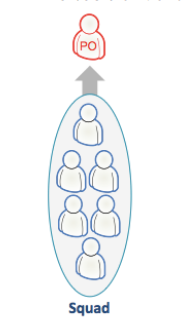
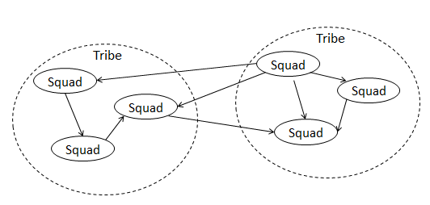

# Case Study - Spotify

> [There is No Spotify Model](https://www.infoq.com/presentations/spotify-culture-stc/)

As with any case study the goal is not to replicate exactly what is seen but rather to take inspiration from and choose those parts that fit into our organisation and extend it further with our own ideas and practices.

Our culture is not the same as the Spotify culture that created this model, if we try to emulate it verbatim we will likely end in failure.

## Squads

The basic unit at Spotify is the squad

A Squad is similar to a Scrum team, and is designed to feel like a mini-­startup. They sit together, and they have all the skills and tools needed to design, develop, test, and release to production. They are a self-­organizing team and decide their own way of working – some use Scrum sprints, some use Kanban, some use a mix of these approaches.

Each squad has a long-­term mission such as building and improving the Android client, creating the Spotify radio experience, scaling the backend systems, or providing payment solutions. The picture below
illustrates how different squads take responsibility for different parts of the user experience.

Squads are encouraged to apply Lean Startup principles such as MVP (minimum viable product) and validated learning. MVP means releasing early and often, and validated learning means using metrics and
A/B testing to find out what really works and what doesn’t. This is summarized in the slogan “Think it, build it, ship it, tweak it”.

Because each squad sticks with one mission and one part of the product for a long time, they can really become experts in that area -­ for example what it means to build an awesome radio experience.

Most squads have an awesome workspace including a desk area, a lounge area, and a personal "huddle" room. Almost all walls are whiteboards. We've never seen a better collaboration space!

To promote learning and innovation, each squad is encouraged to spend roughly 10% of their time on “hack days”. During hack days people do whatever they want, typically trying out new ideas and sharing with their buddies. Some teams do 1 hack day every second week, others save up for a whole “hack week”. Hack days are not only fun, they are also a great way to stay up-­to-­date with new tools and techniques and
sometimes lead to important product innovations! A squad doesn’t have a formally appointed squad leader, but it does have a product owner. The product owner is responsible for prioritizing the work to be done by the team, but is not involved with how they do their work. The product owners of different squads collaborate with each other to maintain a high-­level roadmap document that shows where Spotify as a whole is heading, and each product owner is responsible for maintaining a matching product backlog for their squad.

A squad also has access to an agile coach, who helps them evolve and improve their way of working. The coaches run retrospectives, sprint planning meetings, do 1-­on-­1 coaching, etc.

Ideally each squad is fully autonomous with direct contact with their stakeholders, and no blocking dependencies to other squads. Basically a mini-­startup. With over 30 teams, that is a challenge! We have come a long way, but there are still plenty of improvements to be made. To aid in this, we run a quarterly survey with each squad. This helps focus our improvement efforts and find out what kind of organizational support is needed. Here’s a visual summary of one such survey, showing 5
squads within a tribe:

_The circles show the current state, arrows show the trend. For example we can see a pattern where three
squads reports problems around releasing and that it does not seem to improve -­ this area needs urgent
focus! We also see that squad 4 does not have a great situation with agile coach support, but that it is
already improving._

* Product owner -­ The squad has a dedicated product owner that prioritizes the work and takes both
business value and tech aspects into consideration.
* Agile coach -­ The squad has an agile coach that helps them identify impediments and coaches
them to continuously improve their process.
* Influencing work -­ Each squad member can influence his/her work, be an active part in planning
and choose which tasks to work on. Every squad member can spend 10% of his/her time on hack
days.
* Easy to release -­ The squad can (and does!) get stuff live with minimal hassle and sync.
* Process that fits the team -­ The squad feels ownership of their process and continuously improves
it.
* Mission -­ The squad has a mission that everyone knows and cares about, and stories on the
backlog are related to the mission.
* Organizational support -­ The squad knows where to turn to for problem solving support, for
technical issues as well as “soft” issues.

## Tribes

A tribe is a collection of squads that work in related areas – such as the music player, or backend
infrastructure.

The tribe can be seen as the “incubator” for the squad mini-­startups. , and have a fair degree of freedom and autonomy. Each tribe has a tribe lead who is responsible for providing the best possible habitat for the
squads within that tribe. The squads in a tribe are all physically in the same office, normally right next to each other, and the lounge areas nearby promote collaboration between the squads.

Tribes are sized based on the concept of the “Dunbar number”, which says that most people cannot maintain a social relationship with more than 100 people or so (the number is actually larger for groups that
are under intense survival pressure, which isn’t really the case at Spotify, believe it or not...). When groups get too big, we start seeing more things like restrictive rules, bureaucracy, politics, extra layers of management, and other waste. 

So tribes are designed to be smaller than 100 people or so.

Tribes hold gatherings on a regular basis, an informal get-­together where they show the rest of the tribe (or whoever shows up) what they are working on, what they have delivered and what others can learn from
what they are currently doing. This includes live demos of working software, new tools and techniques, cool hack-­day projects, etc.

## Squad Dependencies

With multiple squads there will always be dependencies. Dependencies are not necessarily bad -­ squads sometimes need to work together to build something truly awesome. Nevertheless, our goal is to have
squads be as autonomous as possible, especially minimizing dependencies that are blocking or slowing a squad down.

To aid in this, we regularly ask all our squads which other squads they depend on, and to what extent those dependencies are blocking or slowing the squad down. Here’s an example:

We then discuss ways to eliminate the problematic dependencies, especially blocking and cross-­tribe dependencies. This often leads to reprioritization, reorganization, architectural changes or technical
solutions.

The survey also helps us see patterns around how squads depend on each other -­ for example that more and more squads seems to be slowed down by operations. We use a simple graph to track how the various
types of dependencies increase or decrease over time. 

Scrum has a practice called “scrum of scrums”, a synchronization meeting where one person from each
team meets to discuss dependencies. We don’t usually do scrum of scrums at Spotify, mainly because most of the squads are fairly independent and don’t need such a coordination meeting.

Instead, scrum of scrums happens “on demand”. For example we recently had a large project that required the coordinated work of multiple squads for a few months.

To make this work, the teams had a daily sync meeting where they identified and resolved dependencies between the squads, and used a board with sticky notes to keep track of unresolved dependencies.

A common source of dependency issues at many companies is development vs operations. Most companies we’ve worked with have some kind of a handoff from dev to ops, with associated friction and
delays.

At Spotify there is a separate operations team, but their job is not to make releases for the squads -­ their job is to give the squads the support they need to release code themselves;; support in the form of
infrastructure, scripts, and routines. They are, in a sense, “building the road to production”.

It’s an informal but effective collaboration, based on face-­to-­face communication rather than detailed process documentation.

## Chapters and guilds

There is a downside to everything, and the potential downside to full autonomy is a loss of economies of scale. The tester in squad A may be wrestling with a problem that the tester in squad B solved last week. If
all testers could get together, across squads and tribes, they could share knowledge and create tools for the benefit of all squads.

If each squad was fully autonomous and had no communication with other squads, then what is the point of having a company? Spotify might as well be chopped into 30 different small companies.

That’s why we have Chapters and Guilds. This is the glue that keeps the company together, it gives us some economies of scale without sacrificing too much autonomy.

The chapter is your small family of people having similar skills and working within the same general competency area, within the same tribe.

Each chapter meets regularly to discuss their area of expertise and their specific challenges -­ for example the testing chapter, the web developer chapter or the backend chapter.

The chapter lead is line manager for his chapter members, with all the traditional responsibilities such as developing people, setting salaries, etc. However, the chapter lead is also part of a squad and is involved in the day-­to-­day work, which helps him stay in touch with reality.

Now, reality is always messier than pretty pictures like the one above. For example, chapter members are not evenly distributed across the squads;; some squads have lots of web developers, some have none. But
the picture should give you the general idea.

A Guild is a more organic and wide-­reaching “community of interest”, a group of people that want to share knowledge, tools, code, and practices. Chapters are always local to a Tribe, while a guild usually cuts across the whole organization. Some examples are: the web technology guild, the tester guild, the agile coach guild, etc.

A guild often includes all the chapters working in that area and their members, for example the testing guild includes all the testers in all testing chapters, but anybody who is interested can join any guild.
Each guild has a “guild coordinator” who, well, does just that :o)
As an example of guild work, we recently had a “Web Guild Unconference”, an open space event where all web developers at Spotify gathered up in Stockholm to discuss challenges and solutions within their field.

Another example is the agile coach guild. The coaches are spread all over the organization, but share knowledge continuously and meet regularly to collaborate on the high level organizational improvement
areas, which we track on an improvement board.

*Wait a sec, isn’t this just a matrix org?*

Yes. Well, sort of. It’s a different type of matrix than what most of us are used to though.

In many matrix organizations people with similar skills are “pooled” together into functional departments, and “assigned” to projects, and “report to” a functional manager.

Spotify rarely does any of this. Our matrix is weighted towards delivery.

That is, people are grouped into stable co-­located squads, where people with different skill sets collaborate and self-­organize to deliver a great product. That’s the vertical dimension in the matrix, and it is the primary one since that is how people are physically grouped and where they spend most of their time.

The horizontal dimension is for sharing knowledge, tools, and code. The job of the chapter lead is to facilitate and support this.

In matrix terms, think of the vertical dimension as “what” and the horizontal dimension as “how”. The matrix structure ensures that each squad member can get guidance on “what to build next” as well as “how to build it well”.

This matches the “professor and entrepreneur” model recommended by Mary and Tom Poppendieck. The PO is the “entrepreneur” or “product champion”, focusing on delivering a great product, while the chapter lead is the “professor” or “competency leader”, focusing on technical excellence.

There is a healthy tension between these roles, as the entrepreneur tends to want to speed up and cut corners, while the professor tends to want to slow down and build things properly. Both aspects are needed,
that’s why it is a “healthy” tension.

## What about architecture?

Spotify technology is highly service-­oriented. We have over 100 distinct systems, and each can be maintained and deployed separately. This includes backend services such as playlist management or
search or payment, and clients such as the iPad player, and specific components such as the radio, or the “what’s new” section of the music player.

Technically, anyone is allowed to edit any system. Since the squads are effectively feature teams, they normally need to update multiple systems to get a new feature into production.

The risk with this model is that the architecture of a system gets messed up if nobody focuses on the integrity of the system as a whole.
To mitigate this risk, we have a role called “System Owner”. All systems have a system owner, or a pair of system owners (we encourage pairing). For operationally critical systems, the System Owner is a Dev-­Ops pair – that is, one person with a developer perspective and one person with an operations perspective.

The system owner is the “go to” person(s) for any technical or architectural issues related to that system.
He is a coordinator and guides people who code in that system to ensure that they don’t stumble over each other. He focuses on things like quality, documentation, technical debt, stability, scalability, and release process.

The System Owner is not a bottleneck or ivory tower architect. He does not personally have to make all decisions, or write all code, or do all releases. He is typically a squad member or chapter lead who has other day-­to-­day responsibilities in addition to the system ownership.

However, from time to time he will take a “system owner day” and do housekeeping work on that system. Normally we try to keep this system
ownership to less than a tenth of a person’s time, but it varies a lot between systems of course.

We also have a chief architect role, a person who coordinates work on high-­level architectural issues that cut across multiple systems. He reviews development of new systems to make sure they avoid common mistakes, and that they are aligned with our architectural vision. The feedback is always just suggestions and input -­ the decision for the final design of the system still lies with the squad building it.

## How is this all working out?

Spotify has grown very fast -­ over 3 years we have grown from 30 to 250 people in tech -­ so we have our share of growth pain! This scaling model – with Squads, Tribes, Chapters, and Guilds – is something that
was introduced gradually over the past year, so people are still getting used to it. But so far, based on surveys and retrospectives, the scaling model seems to be working quite well! And it gives us something to “grow into”. Despite the fast growth the employee satisfaction has continuously increased;; in April 2012 it
was 4.4 out of 5.

However, as with any growing organization, today’s solutions give birth to tomorrow’s problems. So stay tuned, the story isn’t over :o)

/Henrik & Anders
henrik.kniberg@spotify.com
anders.ivarsson@spotify.com