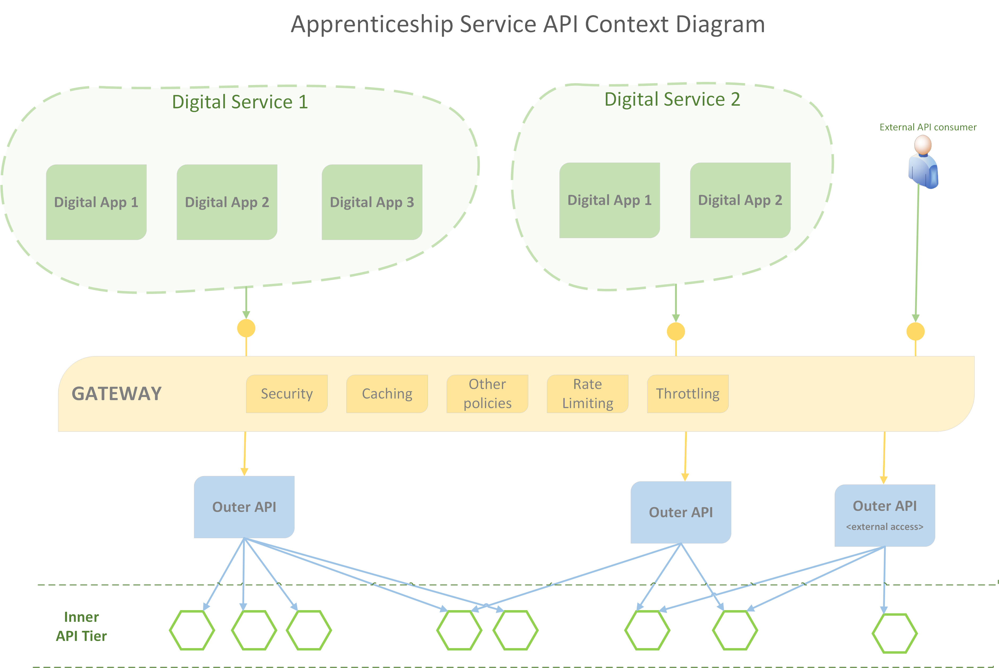

## API Patterns within the AS

The diagram below provides an overall context of how the problem space is decomposed into a number of architectural layers.

|Aspect|Description|Implementation|
|---|---|---|
|Digital Service|A _Digital Service_ as consumed by AS end users (employers, provides, citizens etc.).  Examples of Digital Services within the AS are; Employer Apprenticeship Service, Find Apprenticeship Training|ASP.NET Core Web App.   _Note._ The Web App is only the thin veneer portal.  The portal  redirects to a specific Digital App when users selects a menu option.
|Digital App|A domain focused app that delivers the UI for an aspect of a _Digital Service_.  Digital Products are individually deployable, autonomous UI apps, which are independent of the overall _Digital Service_.  Examples include Reservations and Commitments.|ASP.NET Core Web App.|
|API Gateway|The gateway provides a single access point for all AS API interaction, but does not in itself implement any business logic.  This allows common, cross cutting concerns to be implanted within this layer.  The Gateway implements the [Gateway Offloading Pattern](https://docs.microsoft.com/en-us/azure/architecture/patterns/gateway-offloading) and also the [Gateway Routing Pattern](https://docs.microsoft.com/en-us/azure/architecture/patterns/gateway-routing).| Microsoft Azure API Management
|Outer API|A REST API which presents an easy to consume interface for a Digital App / Service.  It will NOT contain any logic, it acts only as an aggregation layer, calling multiple Inner APIs as needed to service the needs of its client. The Outer API is an implementation of the [Gateway Aggregation Pattern](https://docs.microsoft.com/en-us/azure/architecture/patterns/gateway-aggregation). _Note._ Calls to multiple inner APIs should be executed in parallel, not sequence!|ASP.NET Core Web API.  _Note._  Experiments were undertaken to determine the feasibility of implementing the outer API capability in different ways; within the Gateway via policy, within an Azure Function, and within an Azure Logic App.  All three approaches were problematic, and as such the outer API has been given its own tier.
|Inner API|Implementation of core business domain logic.  Follows Single Responsibility Pattern, and represents a [bounded context](https://docs.microsoft.com/en-us/azure/architecture/microservices/model/domain-analysis) within the domain.  E.g. The Reservations API.|ASP.NET Core Web API.|

### API coupling

In the context diagram above, we can see API calls from a North to South Direction.  Typically, a user will interact with a Digital App (within a Digital Service), and this will result in an API call into the Gateway tier.  Providing there is no policy violation, the Gateway will simply forward the request to the appropriate Outer API.  The Outer API in turn, will call one or more Inner APIs and format an appropriate response.  The response will then be passed back up the chain to the caller.  We can refer to this as North / South Traffic.  

The presence of the Gateway and Outer APIs allow a degree of indirection.  The calling Digital App does not specifically know about the presence of Inner APIs.  As a result, there is potential flexibility to swap implementations within the inner APIs, without a cascade effect to the consuming Digital Services (providing the interface of the outer API remains unchanged).  E.g. an API for address geocoding could be swapped out in place of a different product implementing the same capabilities.

As North / South traffic describes API calls up and down the stack, we can describe calls between APIs within the same tier of the stack as East / West traffic.  As a general rule, we should try and avoid this, as it adds additional coupling and complexity, and can also lead to a runtime _house of cards_ in terms of API calls, where one small failure can de-rail entire trees of API calls.  However, we need to be pragmatic here, and there may be occasions where this is indeed appropriate / necessary - as always ask for advice if you feel you need to do this.

### Key policies within the Gateway tier

The Azure API Gateway allows a number of [policies](https://docs.microsoft.com/en-us/azure/api-management/api-management-policies) to be added to an API Product, an individual API, or a specific API resource interaction.  A few key groups of policies are listed below.

|Policy Group|Description|
|---|---|
|Caching|Where content is safe to cache, enabling caching can offer significant benefits in terms of improving performance and availability, whilst reducing load on back end systems / APIs.  Caches can be varied by a variety of aspects such as; URL, query string, subscription, content type and so forth.|
|Security|Various related policies.  Such as Managed Identities, Check HTTP header, IP black / white list|
|Quotas and throttling|Limit the amount of calls or data exchanged within a timeframe.  Most useful for external APIs.   _Note._ all requests from a consumer (even responses served from cache) count toward their quota. |
|Transformation policies|Can be useful for changing content in the response before it is returned|