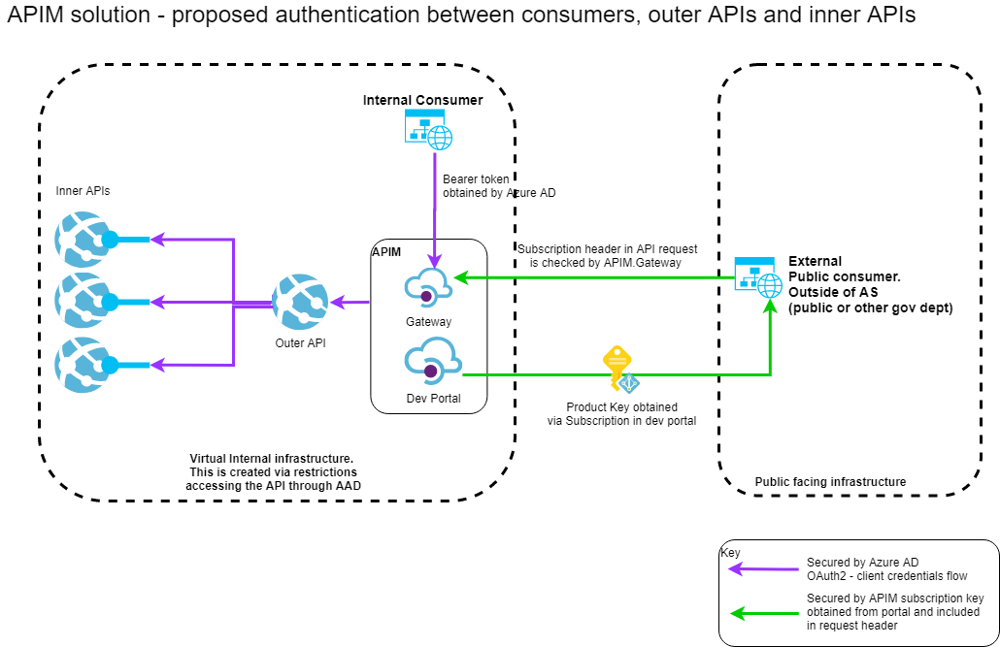

## API Design

The sections above talk about the bigger picture, how APIs fit into that, and why we should have a consistent set of guidance regarding how we approach APIs within the AS.

### When NOT to build an API

Before setting out on a journey to build a new API, check with the AS architect community to ensure that an API is the appropriate solution to the problem.  APIs are only one of the supported integration patterns within the AS, and many integration needs may be better met using other approaches (such as Domain Events).

Going forward, the AS architecture community will be producing guidance on how to determine the appropriate integration approach.  In the meantime, please discuss with an architect before starting work.

### Internal and External APIs

Throughout the guidance references will be made to _internal_ and _external APIs_.  It is therefore useful to define these terms up front to provide an appropriate context for later sections of the guidance.

_Internal API_ - an API consumed ONLY by clients within the Apprenticeship Service Itself.

_External API_ - an API consumed by clients outside of the Apprenticeship Service.  This includes other systems in the wider DfE, other Government Departments, commercial organisations (such as Training Providers, Employers or EPAOs), as well as the general public.

Conceptually, in API design terms there is no difference between internal and external APIs.  The only difference is in terms of how those consumers interact with an API via the Gateway Layer.  External APIs will utilise a different authentication scheme, and will be subject to additional policies such as rate limiting and throttling.

**Note.** the concept of internal and external only applies to _Outer APIs_.  Inner APIs are never directly exposed to consumers (only via an outer API).

### Treat APIs as products, design for your users

When building a new API it is important to understand who your customers are, and what value they intend to extract from your API.  This is especially important for APIs which will be consumed externally to the service.  Such APIs should be treated as _products_ and as with any product, significant effort should be given to researching and understanding the APIs users and their needs.  API documentation should be fit for purpose, and you should consider a technical writer to aid with the documentation.  You should also ensure there is an appropriate test instance accessible.

We should aim to ensure APIs are

- easy to understand
- easy to use
- easy to try
- consistent in their design
- use recognised standards and techniques
- measurable; able to provide stakeholders with usage information and progress vs KPIs

Think about the needs of the key API stakeholders

- API end users (key focus)
- information security officer
- DevOps
- business data owners
- API product owner
o- Apprenticeship Service Quality Guild

### Build a RESTful API

You should design your API around [RESTFul principles](https://restfulapi.net/).  Ensuring you model your API around stable resources, which are manipulated with the standard HTTP verbs. E.g. if you have _review_ resource, then this should exist in your API at one URI, and you should get, create, update, replace and delete that resource at that single URI using the appropriate HTTP verb.  Consequently, avoid modelling the same concepts under different resources in your API - we have seen examples where one URI is being used for GETs and a separate URI / resource  used for updates to the same thing - this is NOT recommended.

Ensure that the resources are based upon domain concepts, and do not leak out implementation details (such as system specific keys), as doing so will make it harder to change underlying implementations going forward.

You should verify your API design against [level 3 of the Richardson Maturity Model](https://martinfowler.com/articles/richardsonMaturityModel.html).  However, we should not dogmatically implement all aspects of level 3, and do things _just because level 3 says we should_.  At times, we need to be pragmatic and implement what is needed, but always working with the sprit and ethos of the standard (not against it).

### API Security

In the diagram below, you can see where security is applied.  In short, this is between the consumer and the gateway, the gateway and the outer API, and the outer API and the inner API.

Note. the aim is to have all API consumption (internal and external) routed via the Gateway.  This will enable policy to be applied in a consistent manner, and will facilitate API discoverability.



The diagram also shows two user types, and internal user and an external user.  The way these users authenticate is different.  The table below shows the applicable security approaches in each circumstance.

||Internal client|External client|
|---|---|---|
|Client to gateway|Azure AD, [client credentials flow](https://auth0.com/docs/flows/concepts/client-credentials).|Azure API Management [Subscription Key](https://docs.microsoft.com/en-us/azure/api-management/api-management-howto-create-subscriptions)|
|Gateway to outer API|Azure AD [client credentials flow](https://auth0.com/docs/flows/concepts/client-credentials).|Azure AD, [client credentials flow](https://auth0.com/docs/flows/concepts/client-credentials)|
|Outer API to inner API|Azure AD [client credentials flow](https://auth0.com/docs/flows/concepts/client-credentials).|Azure AD, [client credentials flow](https://auth0.com/docs/flows/concepts/client-credentials)|

### Avoid vendor lock in

Government guidance talks at length about the need to avoid lock-in to a specific vendor ([ref1](https://www.gov.uk/guidance/managing-technical-lock-in-in-the-cloud), [ref2](https://www.gov.uk/government/publications/open-standards-principles/open-standards-principles)).  The use of Outer APIs allows a level of indirection between the API consumer, and the inner APIs delivering the business / technical capabilities.  It is important that this layer us used to abstract away implementation details, especially regarding commercial offerings which we may want to swap in the future.  For example, consider a course directory search which needed to return distance from the users location.  The Outer API should take care of the location aspects as well as the search, thus hiding the location capability implementation details from the calling client, making it easier to change vendors in the future.

### Building consistent APIs

The guidance thus far, offers a broad framework within which, individual APIs exist.  We want to build on this, to ensure that consumers of AS APIs receive a consistent and common experience when using APIs across the service.  This will make delivering products based upon these APIs  easier for internal and external developers alike.  Toward the goal of API consistency, some standards are provided below.

#### Naming conventions

- use nouns rather than verbs
- be short, simple and clearly understandable
- be human-guessable (domain based), avoiding technical or specialist terms where possible
- use hyphens rather than underscores as word separators for multiword names

#### Use JSON

Your first choice for all web APIs should be JSON where possible.  Only use another representation to build something in exceptional cases, like when you:

- need to connect to a legacy system, for example, one that only uses XML
- will receive clear advantages from complying with a broadly adopted standard (for example, SAML)

We recommend you should:

- create responses as a JSON object and not an array (JSON objects can contain JSON arrays) - arrays can limit the ability to include metadata about results and limit the API’s ability to add additional top-level keys in the future
- document your JSON object to ensure it is well described, and so that it is not treated as a sequential array
- avoid unpredictable object keys such as those derived from data as this adds friction for clients
- use CamelCase for property names.
- use consistent domain language for JSON properties.

An example partial JSON payload is as follows:
```json
{
    "AccountId": 8123,
    "AccountName": "ADAM & ADAM PROPERTIES LTD",
    "DateRegistered": "2017-10-31T10:24:50.003",
    "OwnerEmail": "fred.bloggs@ltest.com"
}
```

#### Representing time and date

The government mandates using the [ISO 8601 standard](https://www.gov.uk/government/publications/open-standards-for-government/date-times-and-time-stamps-standard) to represent date and time in your payload response. This helps people read the time correctly.

Use a consistent date format. For dates, this looks like 2017-08-09. For dates and times, use the form 2017-08-09T13:58:07Z.

#### Representing a physical location

You should use [GeoJSON](https://geojson.org/) (also ratified as standard [RFC7946](https://tools.ietf.org/html/rfc7946)) for the exchange of location information.

An example GeoJSON payload for a single point is as follows:

```json
     {
         "type": "Point",
         "coordinates": [100.0, 0.0]
     }
```

Use the Global Coordinate System (GCS) [WGS84](https://gisgeography.com/wgs84-world-geodetic-system/).

#### Use Unicode for encoding

The [Unicode Transformation Format (UTF-8)](https://en.wikipedia.org/wiki/UTF-8) standard is[ mandatory for use in government](https://www.gov.uk/government/publications/open-standards-for-government/cross-platform-character-encoding-profile) when encoding text or other textual representations of data.

#### Searching and filtering

It is recommended that simple searching and filtering against a resource collection be achieved by specifying query string arguments against the resource in question.  For example;

`/users?status=active`

You should not be using search as a means for identifying a single resource by its moniker.  i.e.  don't do this `/users?id=1`, instead address the specific resource directly, like this `/users/1`.

For more complex search requirements (complex queries, or queries across resources), consider implementing either a specific search controller, or potentially [GraphQL](https://graphql.org/).  Before using GraphQL, please seeks advise from the architecture community.

#### Paging

Where a resource could contain a significant amount of data you should implement paging.  API clients should be able to request a specific page via the query string, e.g. `/users?page=4` to request the 4th page in the list.  It is fine for the API itself to define a sensible page size.  If no specific page is requested, then all results should be returned.  The only exception is if returning all data would would be inappropriate, e.g. causing a performance issue. In such cases, the API should return `400 - Bad Request`, and the body of the response should indicate paging is mandatory.

See section below on hyper media for information on advertising page links.

#### Sub resources

Sub-resources must appear under the resource they relate to, but should go no more than three deep, for example: `/resource/id/sub-resource/id/sub-sub-resource`.

If you reach a third level of granularity (sub-sub-resource), you should review your resource construction to see if it is actually a combination of multiple first or second level resources.

#### Hyper Media

As discussed earlier, we should aim to design APIs which conform to level 3 of the Richardson Maturity Model, which talks about hyper media (allowing the actions that can be performed on a resource to be discoverable).  However we do not believe we should dogmatically follow the level 3 for the sake of it.  Instead, we should provide hypermedia links where it makes sense to advertise useful actions.

Rather than trying to follow a complete hypermedia specification such as [HAL](https://en.wikipedia.org/wiki/Hypertext_Application_Language) or [JSON.API](https://jsonapi.org/) - we feel these standards add too much complexity for the benefit they provide.  Instead, we prefer to annotate general good API design with appropriate hypermedia links using the [format defined here](https://restfulapi.net/hateoas/).

An example set of hypermedia links are given in the partial sample below, which shows a set of courses provided by a given training provider.  The example provides an array of courses, and links to; get information about the training provider itself, as well as paging links:

```json
{
  "Page": 3
  "Courses": [
    {}, 
    {}, 
    {}
  ],
  "Links": [
      {
          "Rel": "training-provider",
          "Href": "fatv2/provider/4",
          "Type": "GET"
      },
      {
          "Rel": "prev-page",
          "Href": "fatv2/provider/4/trainingcourses?page=2",
          "Type": "GET"
      },
      {
          "Rel": "next-page",
          "Href": "fatv2/provider/4/trainingcourses?page=4",
          "Type": "GET"
      }]
}
```

### Make error messages meaningful

In addition to meeting the requirements of HTTP around which headers to send when in terms of responding to successful requests, we also need to ensure that we return meaningful information back to users when requests fail.

For example, if a request is made is missing data / invalid for some reason, do not just return a `400 - Bad Request`.  Instead, in the body return an object which offers some explanation of the issue, and explains that the client should not repeat the request without modification.  Whilst we should be helpful in terms of error condition responses, we should also be careful that we do not leak any technical implementation details within the response, which could be used to probe for vulnerabilities by a would be hacker.

For public APIs, ensure error responses are tested with external API consumers.

#### Document your API

Whether an outer or inner API, it should be documented in using the [Open API 3 specification](https://github.com/OAI/OpenAPI-Specification/blob/master/versions/3.0.2.md).  This makes it easier for users to discover API capabilities and to produce a central repository of available APIs which can be discovered.

We are able to autogenerate Open API 3 specifications for .net components at build time using tools such as Swashbuckle ([Swashbuckle supports Open API 3 from version 5](https://github.com/domaindrivendev/Swashbuckle.AspNetCore/releases/tag/v5.0.0)).  However, API designers must think about the API design independently of the implementation - the API itself is the central concept (not the code).  We should not be coding a .net solution and just autogenerating an API definition at the end.  Before coding, a clear API blueprint should be produced for peer review and comment.  This API should be based upon stable domain concepts (resources), as opposed to _database entities_.

_Note_ your API must provide a separate swagger endpoint for each version of the API it implements.
