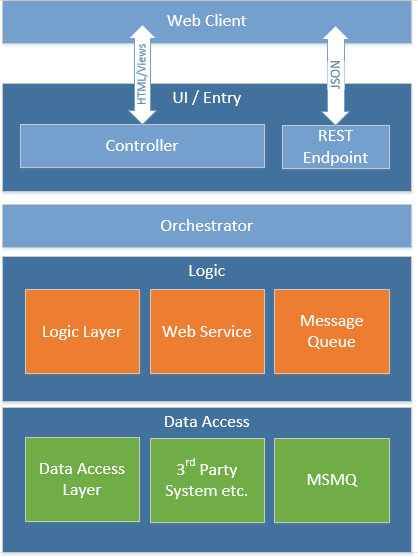

## Development Patterns

Below are described the major engineering patterns currently in-use across the Service. There is no definitive list as it is understood that patterns should be used when and where appropriate.

### Orchestrator

> At times an orchestrator may be unnecessary for a light weight controller action and it may be easier and less complex to omit the orchestrator completely and instead inject Mediatr directly into the controller.

As controllers age they are asked to do more and more work which can result in serious bloat. We want to keep our controllers focused on what they should be doing such as handling requests, invoking business rules and returning responses. So to keep them light we need to hand-off any other work that may end up in a controller out to somewhere else and the Orchestrator can be used to fill this need. 

The use of Orchestrators can also make a codebase more testable by moving logic and flow out of controllers and their tight coupling to the runtime.



#### Example

    public class ProductsController : Controller
    {
        private readonly IProductOrchestrator _orchestrator;

        public ProductsController(IProductOrchestrator orchestrator)
        {
            _orchestrator = orchestrator;
        }
        
        public ActionResult Index()
        {
            var productsResult = _orchestrator.GetProducts();

            return View(new ProductsModel
            {
                Products = productsResult.Products
            });
        }
    }

    public class ProductOrchestrator : IProductOrchestrator
    {
        private readonly IMediator _mediator;

        public ProductOrchestrator(IMediator mediator)
        {
            _mediator = mediator;
        }
        
        public IList<Product> GetProducts()
        {
            return = _mediator.Send(new GetProductsQuery());            
        }
    }


#### References

* [Simplify Your Architecture Using the Orchestrator Pattern](http://www.jamiemaguire.net/index.php/2017/05/06/simplify-your-architecture-using-the-orchestrator-pattern/)
* [The Orchestrator Pattern](http://www.michaeltaylorp3.net/orchestrator-pattern/)
* [Never Mind the Controller, Here is the Orchestrator](https://www.simple-talk.com/dotnet/asp-net/never-mind-the-controller-here-is-the-orchestrator/)
  
### The Mediator Pattern & Mediatr

With the mediator pattern, communication between objects is encapsulated within a mediator object and do not communicate directly with each other, but instead communicate through the mediator. This reduces the dependencies between communicating objects and reduces coupling.

> When seeking to use the Mediatr pattern you should look to use it as a mechanism to decouple the different application layers and resist the urge to use it as a code-reuse pattern for which other approaches are more appropriate.

#### Example

    public class ProductController : Controller
    {
        private readonly IMediator _mediator;

        public ProductsController(IMediator mediator)
        {
            _mediator = mediator;
        }

        [HttpPost]
        public ActionResult Rate(RateProduct rateProduct)
        {
            _mediator.Send(new RateProductCommand(rateProduct));
            return View();
        }
    }    

#### References

* [Mediatr - GitHub](https://github.com/jbogard/MediatR)
* [Thin Controllers with CQRS & Mediatr](https://codeopinion.com/thin-controllers-cqrs-mediatr/)
* [Simplify Your Controllers With the Command Pattern and Mediatr](https://jonhilton.net/2016/06/06/simplify-your-controllers-with-the-command-pattern-and-mediatr/)
* [Mediatr Criticism](http://scotthannen.org/blog/2020/06/20/mediatr-didnt-run-over-dog.html)


### Command Query Responsibility Segregation (CQRS)

The Command and Query Responsibility Segregation (CQRS) pattern separates read and update operations for a data store. This segregation can allow us to maximize an applications performance, improve its scalability, and simplify its security model.

Performance is improved by separating the read and write operations within the application. A read operation may have a significantly different profile to an write operation. Separating then means that each can focus on what it needs, for instance there may be properties of the data that must be updated for a successful write operation but which are not needed when reading the data.

Data contention can be reduced by removing the times that reads and writes are accessing the same data at the same time. For instance writes may be placed on a queue to be actioned for asynchronous processing and you may separate out the read data store from the write store.

Securing a task based write operation such as 'Book Ticket' may be easier than choosing which individuals properties of a data representation can be updated in a more traditional model.

* Commands and used to update data and should be task based not data centric ('Book Room' rather than 'set ReservationStatus to Reserved')
* Queries used to read data should never be used to update it, contain domain logic and should only return a DTO.
* Commands and Queries should not depend on each other. If there is a need to share functionality or data the logic should be moved into a new shared Application Service.


Another positive side-effects of using CQRS is that there are naturally less merging issues when working in a team as the codebase is broken into smaller, more cohesive chunks.

#### Example Command

    public class RateProductCommand
    {
        public int UserId { get; set; }
        public int Rating { get; set; }
    }

    public class RateProductCommandHandler : ICommandHandler<RateProductCommand>
    {
        private readonly IRepository<Product> repository;

        public ProductsCommandHandler (IRepository<Product> repository)
        {
            this.repository = repository;
        }

        public async Task Handle (RateProductCommand command)
        {
            var product = repository.Find(command.ProductId);
            if (product != null)
            {
                product.RateProduct(command.UserId, command.Rating);
                repository.SaveAsync(product);
            }
        }
    }

#### Example Query

    public class GetProductsQueryHandler : IQueryHandler<GetProductEntitiesRequest, GetProductsEntitiesResponse>
    {
        private readonly IQueryRepository<ProductDto> _repository;

        public GetProductsQueryHandler(IQueryRepository<ProductDto> repository)
        {
            _repository = repository;
        }

        public async Task<GetProductsEntitiesResponse> Handle(GetProductEntitiesRequest query)
        {
            var products = await _repository.GetList();

            var response = new GetProductsEntitiesResponse
            {
                Products = products
            };

            return response;
        }
    }

#### References

* [CQRS - Microsoft](https://docs.microsoft.com/en-us/azure/architecture/patterns/cqrs)
* [CQRS - Martin Fowler](https://martinfowler.com/bliki/CQRS.html)


### Managed Identities (MI)

Using a managed identity allows an application to authenticate to any service that supports Azure AD authentication without having credentials.

* Secretless configuration
* Acquiring a bearer token for an API behund Azure AD authentication
* Connecting to a SQL database

The ```Microsoft.Azure.Services.AppAuthentication``` library manages authentication automatically

#### Example - Authenticating with another app service, eg internal API

    public class ApiClient
    {
        private readonly HttpClient _httpClient;

        public ApiClient(IHttpClientFactory httpClientFactory) {
            _httpClient = httpClientFactory.CreateClient();
        }

        public async Task<string> GetAccessTokenAsync(string identifier)
        {
            var azureServiceTokenProvider = new AzureServiceTokenProvider();
            var accessToken = await azureServiceTokenProvider.GetAccessTokenAsync(identifier);
            
            return accessToken;
        }

        # Acquire a bearer token
        var identifier = "https://tenant.onmicrosoft.com/das-env-api-as-ar" # IdentifierUri of Azure AD App registration
        var accessToken = await GetAccessTokenAsync(identifier);

        # Add the token as a header
        _httpClient.DefaultRequestHeaders.Authorization = new AuthenticationHeaderValue("Bearer", accessToken);

        # Make an API call
        var response = await _httpClient.GetAsync("https://azurewebsites.net/resource/resourceid");
    }

#### Example - Connectiong to a SQL database

    protected override void OnConfiguring(DbContextOptionsBuilder optionsBuilder)
    {
        var connectionString = "Server=tcp:<server-name>,1433;Initial Catalog=<database-name>;"
        var azureServiceTokenProvider = new AzureServiceTokenProvider();

        var connection = new SqlConnection
        {
            ConnectionString = connectionString,
            AccessToken = azureServiceTokenProvider.GetAccessTokenAsync("https://database.windows.net/").Result
        };
        optionsBuilder.UseSqlServer(connection);
    }

#### References

* [MI Overview - Microsoft](https://docs.microsoft.com/en-us/azure/active-directory/managed-identities-azure-resources/overview)
* [MI Obtain tokens for Azure resources - Microsoft](https://docs.microsoft.com/en-us/azure/app-service/overview-managed-identity?tabs=dotnet#asal)
* [MI Connecting to a SQL database - Microsoft](https://docs.microsoft.com/en-us/azure/app-service/app-service-web-tutorial-connect-msi)
