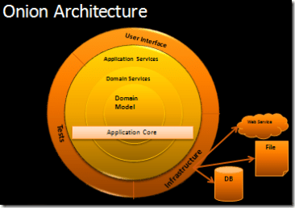
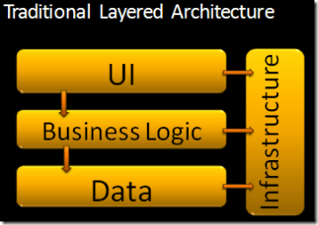

## Solution architecture

### Onion architecture

The [Onion Architecture](http://jeffreypalermo.com/blog/the-onion-architecture-part-1/) was proposed by Jeffrey Palermo in 2008 to produce more maintainable applications by emphasizing the separation of concerns throughout a system. Similar to [Hexagonal Architecture](https://en.wikipedia.org/wiki/Hexagonal_architecture_(software)) it forces the externalization of infrastructure, the use of interfaces for behaviour contracts and describing dependencies that only "flow" in one direction, toward the centre and the Domain Model. In the Onion architecture the edges of the onion are where the most change is likely to happen and is where the UI, Tests and Infrastructure is found. 



Onion Architecture is in contrast to a layered architecture where layers are coupled to the one below them and potentially to various infrastructure concerns.



Core Concepts:

* It emphasizes the use of interfaces for behaviour contracts, and it forces the externalisation of infrastructure
* Helps to decouple system dependencies by stating that all code can depend on layers more central, but code cannot depend on layers further out from the core
* The first layer around the Domain Model is typically where we would find interfaces that provide object saving and retrieving behaviour, called repository interfaces
* Object saving behaviour is *not* in the application core, only the interface is in the application core
* On the edges we see UI, Infrastructure, and Tests

Limitations:

* It is appropriate for long-lived business applications as well as applications with complex behaviour
* Relies heavily on the Dependency Inversion principle

#### References

* [Onion Architecture Part 1](http://jeffreypalermo.com/blog/the-onion-architecture-part-1/)
* [Onion Architecture Part 2](https://jeffreypalermo.com/2008/07/the-onion-architecture-part-2/)
* [Onion Architecture Part 3](https://jeffreypalermo.com/2008/08/the-onion-architecture-part-3/)
* [Onion Architecture Part 4](https://jeffreypalermo.com/2013/08/onion-architecture-part-4-after-four-years/)
* [Example Application](https://bitbucket.org/jeffreypalermo/onion-architecture/src/default/)
* [Hexagonal Architecture](https://en.wikipedia.org/wiki/Hexagonal_architecture_(software))

### Solution structure and layout

The intention of this section is to outline preferred naming conventions and usage for the types of projects that might be included in a solution. The goal is to ensure that common patterns are used throughout the service, rather than each team adopting their own standard.

Note that there is no one prescribed structure for any given solution, regardless of the type of solution being worked on. It is intended that teams have the flexibility they need to include the projects that are relevant to them.

#### Solution
Wherever possible, solutions should:
* Adopt the naming convention SFA.DAS.{SolutionName} (where {SolutionName} is a meaningful name relevant to the piece of work this solution is for).
  * Note that in any of the project suggested below, the * in the project name should be the same as the solution name.
* Have a single responsibility. Where a solution requires a website and an API, for example, each should be built in separate solutions.
* Have its own repo in GitHub.

Solutions can contain any of the below projects. Only projects that are relevant to the work being completed should be included.

#### API projects
Where you have an API, use these projects to configure your endpoints. THe core logic should be in the separate Application project.
```
SFA.DAS.*.Api
SFA.DAS.*.AcceptanceTests
SFA.DAS.*.UnitTests
```

##### Application projects
Use these projects for your application's core logic.
```
SFA.DAS.*.Application
SFA.DAS.*.Application.UnitTests
```

##### Commands projects
Use these projects for your CQRS pattern commands (add/update/delete data).
```
SFA.DAS.*.Commands
SFA.DAS.*.Commands.UnitTests
```

#### Data projects
Use this project for classes that implement the repository pattern for data access. This uses abstract methods to access or modify data without having a direct reliance on an actual database.
```
SFA.DAS.*.Data
SFA.DAS.*.Data.UnitTests
```

#### Database projects
Use this project for database scripts (.sql) for things like creating tables and adding indexes for your solution.
```
SFA.DAS.*.Database
```

#### Domain projects
Use this project for your domain objects (models).
```
SFA.DAS.*.Domain
SFA.DAS.*.Domain.UnitTests
```

#### Events projects
Use these projects for any event based logic and associated handlers.
```
SFA.DAS.*.Events
SFA.DAS.*.Events.UnitTests
```

#### Functions projects
Use these projects for Azure functions projects and durable functions. These will contain your orchestrators, triggers and activities.
```
SFA.DAS.*.Functions
SFA.DAS.*.Functions.UnitTests
```
#### Infrastructure projects
?
```
SFA.DAS.*.Infrastructure
SFA.DAS.*.Infrastructure.UnitTests
```

#### Jobs projects
Use these projects for any scheduled tasks that need to run on a server.
```
SFA.DAS.*.Jobs
SFA.DAS.*.Jobs.UnitTests
```

#### Mock projects
Use these projects to create mock instances for use when testing your applications.
```
SFA.DAS.*.MockServer
```

##### Queries projects
Use these projects for your CQRS pattern queries (data retrieval).
```
SFA.DAS.*.Queries
SFA.DAS.*.Queries.UnitTests
```

#### Web projects
Web projects are used for applications that have a web-based user interface. These projects typically follow the MVC pattern.
```
SFA.DAS.*.Web
SFA.DAS.*.Web.AcceptanceTests
SFA.DAS.*.Web.UnitTests
```

The [das-reservations](https://github.com/SkillsFundingAgency/das-reservations) codebase is a great example of how to structure an Apprenticeship Service codebase
