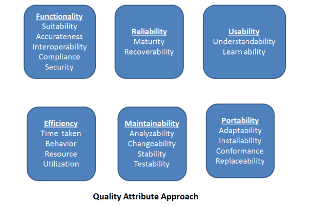
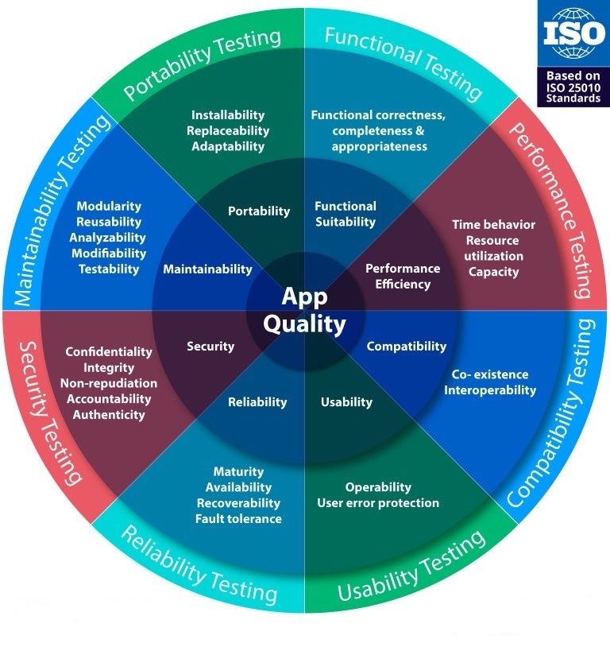
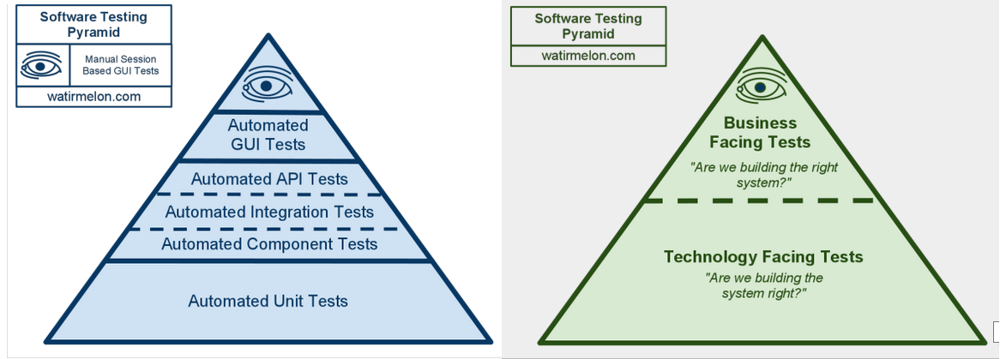

# Quality Assurance Goals

1. Defect prevention
2. Identify the bugs/gaps in SDLC
3. Gain confidence in and giving information about the quality level
4. Ensuring that the end result meets the user and business requirements
5. Gain the customers' confidence by offering them a quality product

# Quality Assurance Principles

## Scope and Approach:
This document defines a high-level Test Plan of Apprenticeship Service for all non developer actioned testing. The document includes references to 'the product testing team' comprised of personnel from product development team and Integration/User Acceptance testing team. The entire product development/testing team and application integrator team has a collective responsibility for quality (i.e. product is fit for purpose) from development onwards. The Test Plan is being suitably implemented in context, and in an efficient and cost-effective manner (e.g. using an automation framework and approach that enables testers to test). The test effort will be prioritised and executed based on the project priorities. This is a living document that may be refined as the project progresses. The QA Manager, Test Team Lead, Product Owner and Delivery Manager shall review and approve the final version of the Test Strategy document.

The core objective of this Quality Assurance (QA) strategy is to design a high level of quality using a blended testing approach (Operational, Performance, Security, Accessibility and Functional) by utilising appropriate manual testing techniques and intelligently automated testing frameworks. This proven approach reduces cost, time and complexity while increasing quality through the agile life cycle to rapidly pinpoint and fix user/business focused defects in continuously delivered digital product.

The technical testing approach to automation prioritises areas of User Interface (UI) and the Application Programming Interface (API) / Service Layer that deliver relevant coverage holistically across the product surface. The test automation includes creating tests for each User Story/ Use Case and developing the automation code for each test, executing and maintaining the framework.

* **UI Automation:** The UI testing framework is implemented using a TDA (Technical Design Authority) approved DOTNET Core framework with Selenium via a standard C#/Spreflow project
* **API Automation:** The API test automation is currently being planned, but no automation framework is in place. However, Manual API testing is carried usaing Postman, RestClient etc tools

## Testing Stages

### Functional Testing:
Manual Quality Assurance activities will be performed on both UI and API for each user story, using the following checklist:-
* Scenarios and functionality match the Acceptance Criteria,
* Perform positive, negative and extensive exploratory testing simulating what a potentially unfamiliar user might do during use to make sure no functional issues are present
* All negative scenarios are handled and provides appropriate response to the user
* Response for every action (including spelling) match the requirements
* Auditable artefacts are produced.
* UI Functional tests:-
  - UI tests are user journey based to determine how the software should work and how it should not work based on the user actions in both positive and negative scenarios
  - Functional automated tests are designed to cover critical priority paths through the application and covering all core functionality
* API tests:-
  - API / Service Layer tests are the customer's examples of how the software should work based on the input data
  - The automated tests are designed to exercise the service layer specification by sending the requests compares the actual and expected results to determine whether the software behaved as expected.
* Negative testing is a subset of functional testing and the negative scenarios will be automated subject to the discretion of the product test team - in line with coverage goals.

### Integration Testing:
* The product development and testing teams will work collaboratively on Integration testing (both API and UI) in context with Performance, error handling and alerting, operational criteria and usability
* Code level integration tests will be created by development team and manual/automated integration testing will be carried by testing team to ensure the integration between the components is stable and the service is responding as required in both positive and negative scenarios

### End-To-End Testing:
* Product development team will be responsible for the full End-To-End testing foe every modification and each release
* Along with that Acceptance Testing team (Model Office) will perform additional end-to-end testing coverinf the business scenarios for every major release

### System Testing:
  - System testing will focus on the functionality of the application and will verify the correctness of the newly designed features/fixes and their iterations with the existing functions.
  - Testing will be accomplished through an organised testing process that will have repeatable tests.
  - Test scripts will be structured to give a full range of coverage to the converted functions in both Positive and Negative fashion.
  - Positive test cases will reflect that the application functions as expected, Negative test cases are tests that exercise the limits and boundaries outside the expected design. The result of this testing will give the idea as to the stability for the application and its components.

### Regression Testing:
  - The Test Team will do a pass through all the test scripts that were developed for this project. This will encompass the re-testing of each item in each test script as well as the re-verification of each repaired defect that is decided on as an items to be regressed based on the severity of the defect and the knowledge of the development staff as to which areas of the application are the most volatile due to new features being implemented.
  - Testing team will perform as many test scenarios as is feasible.

### User Acceptance Testing:
  - UAT is out of scope for the product test team.
  - Model Office team will perform additional tests to verify the product fits the purpose from Service E2E point of view

### Non-Functional Testing:
#### Performance Testing:
  - UI: A dedicated **TrueClient (Load Runner)** performance testing framework being used to conduct Application performance testing, which supports conducting different types of performance tests, including Load test, Stress test and Soak test
  - Currently Performacne Testing is out of scope for Product Testing team, this is being handled by a Performance team at program level.
  - The product testing team will be responsible for identifying and planning Performance testing requirements for each modification
  - Detailed performance testing will be carried out for every major release and provide reports
  
#### Accessibility Testing:
  - API: Accessibility testing of the API is out of scope
  - UI: Web accessibility testing is a subset of usability testing, which aims to discover how easily people can use a website considering the users with disabilities that affects how they use web
  - The testing team will be responsible to conduct/organise high-level accessibility testing using tools approved by TDA and provide reports for every release
  - 'SortSite' accessibility tool will be used to carry out semi- automated accessibility evaluation which checks the markup validity of Web document in HTML, XHTML and CSS
  - Manual Keyboard accessibility will be conducted to verify user navigation without having to use a mouse
  - Apprenticeship Service also has an external service provider (das - digital accessibility centre) to carry out a full Accessibility Evaluation againt the industry standards and provides the reports. The product team is responsible for planning and organising this service via Test Lead.

#### Security Testing:
  - Currently Security Testing is out of scope for Product Testing team, this is being handled by a Security team at program level.
  - The product testing team will be responsible for identifying and planning Security testing requirements for each modification
  - Detailed performance testing will be carried out for every major release and provide report

#### Unit Testing:
  - Delivery of unit tests (and potentially TDD) are out scope for the product test team, these areas are undertaken by the development team.
  - The product test team will be required to review unit tests (through colloboration with Developers) to help determine coverage from functional automation perspective.
  
## Testing Techniques
  
### Manual Testing
  * Positive Testing
  * Negative Testing
  * Exploratory Testing
  
### Test Automation

  * Unit Tests
  * Integration Tests
  * API Tests
  * UI Tests

  **NOTE: Test automation code must follow the [Coding Principles]({{ 'development/coding-principles' | relative_url  }})**
 
## Test Patterns
  * UI Testing
  * API Testing
  * Database Testing

## Entry & Exit Criteria:

### Entry:
The entry criteria or the actions required before test activities can commence are:-
  * User story or task is accepted into the sprint
  * BA will have produced acceptance criteria or TDD/BDD scenarios for the story/technical task accepted
  * Story/task has been completed i.e. developed, reviewed and is passing all unit tests (Meeting developer definition of done)
  * Feature Branch aligned with MASTER Branch without any conflicts
  * Verify code review completed and no conflicts

### Exit:
The exit criteria for the testing activities to be considered as complete are:-
  * Validate the latest feature branch builds and deploys successfully
  * Manual positive, negative and exploratory testing is performed to verify expected behaviour is achieved
  * Where possible a unique test is created/updated in test automation suite for story/task under test or JIRA is raised
  * Any regression tests failed must be fixed
  * Verify all unit tests and functional tests passed and no regression issues
  * Appropriate cross team testing executed and passed (Integration & End-To-End)
  * Report test results and provide any feedback
  * Product owner accepted

### Suspension:
  * If any defects identified as part of a story/task, will be sent back into the development process, which will then go through entry and exit criteria
  * A defect which has been identified independent of any story/task will be entered into JIRA, which will be prioritised to feed back into the development process
  * The entry criteria or the actions required before test activities can

## Defect Management
Defect management should be a lightweight process in an agile environment. In this instance, the following generic approach is recommended: 
  *	Defects are primarily identified via manual/automated functional, accessibility, security, and performance tests, as well as via frequent end-user, business, and delivery team testing.
  *	Multiple defects may initially be grouped into a single defect to enable more efficient remediation. For example, UI layout defects applicable to a specific browser may be combined on one defect ticket. This decision will be taken based on context and team collaboration.
  * Defects are delivery team ‘triaged’ and assigned for remediation by the Delivery Manager based on priority and resources.
  *	A good - delivery pragmatic - defect management process should incorporate direct feedback from the QA to the Development team 'across the desk' to maintain velocity and help build quality into the product without unnecessary overhead (especially important in smaller agile teams with limited resources).
  
  Defects may be prioritised based on perceived user impact, as outlined in the examples below.
  **Critical:**
  - No workaround exists.
  -	Impacts all users and all user activities.
  -	Loss of revenue and / or loss or reputation as a consequence of multiple users and / or customers experiencing the outage.
  
  **High:**
  -	A workaround would require significant additional user effort.
  -	Impacts a large number of users and crucial user activities.
  -	Some loss of revenue and / or loss or reputation as a consequence of multiple users and / or customers experiencing the issue.
  
  **Medium:**
  -	A workaround would require moderate additional user effort.
  -	Impacts a moderate number of users and no crucial user activities.
  -	It Is possible to fix at a future point without impacting users or operations.
  -	Is needed prior to business acceptance.
  
  **Low:**
  -	A workaround would require very low additional user effort.
  -	Minor operational and user impact and no user activities are affected.
  -	Does not cause serious confusion to the user.
  -	It is not needed prior to business acceptance.
  
**NOTE: This document is subject to change as part of a continuous review and improvement process**