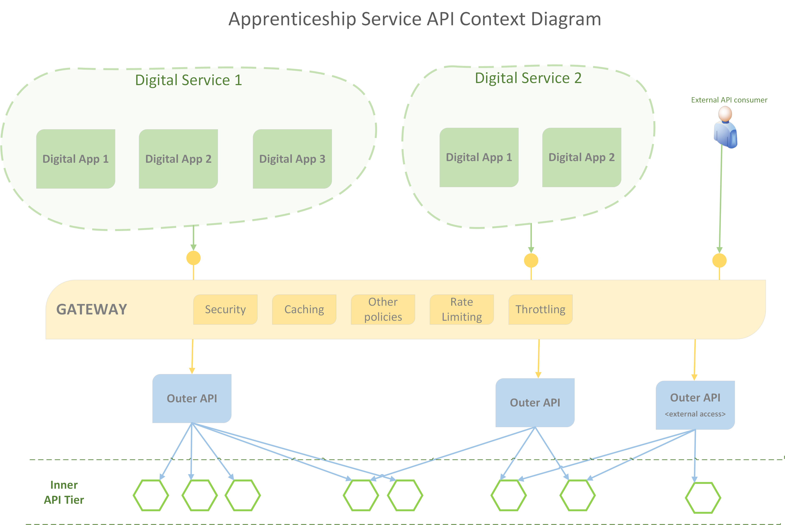
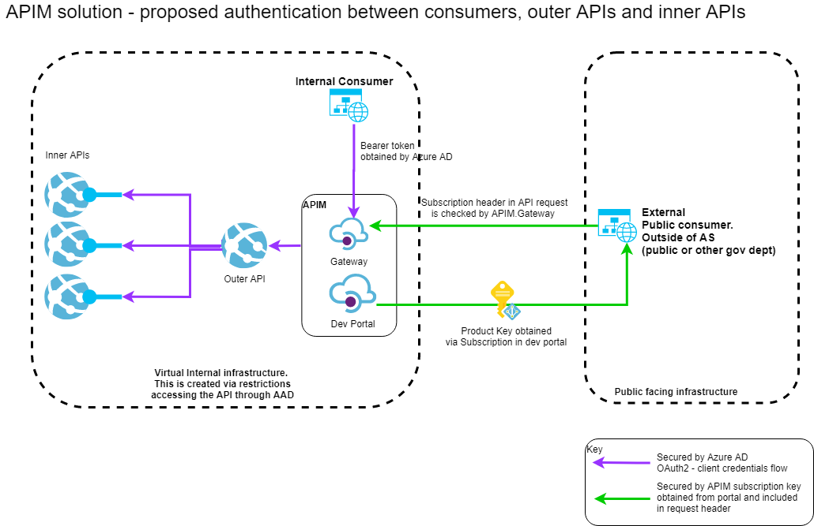

# Apprenticeship Service API Standards

## Introduction

The Apprenticeship Service API Standards draw influence from the following.

- [API technical and data standards (v2 - 2019)](https://www.gov.uk/guidance/gds-api-technical-and-data-standards)
- [Technology Code of Practice](https://www.gov.uk/government/publications/technology-code-of-practice/technology-code-of-practice)
- DfE API Strategy - May 2019, V3.0 (no link available)

This guide provides the standards which are to be applied to any new APIs developed within the Apprenticeship Service.

## Aims and Objectives

This section sets of the key aims and objectives of the AS in defining API standards.

|Objective   | Solution  | Notes |
|---|---|---|
| Achieve a standard way of designing, building and operating APIs | Define a set of principles, building blocks and standards to ensure new APIs have a standard approach | Thought to be given to updating existing APIs to the new standard |
|Enable the rapid delivery of new _Digital Products_ and services|Use architectural patterns inspired by  [Backends For Frontends](https://samnewman.io/patterns/architectural/bff/), and MASA (Mesh Apps and Services architecture [ref1](https://www.gartner.com/en/documents/3805663), [ref2](https://medium.com/@sreelathas/why-masa-is-the-future-897f470dc399)) to deliver services which can be quickly composed into new _Digital Products_|_Note._ In the AS, the concern is less about different client device types (mobile vs web), and more about different _Digital Products_ sharing common services.|
|Reduce complexity of AS component interoperability |By providing common standards and approaches, there will be a uniform approach to APIs across the AS, making consuming APIs easier||
|Loose coupling / separation of concerns |Domain oriented services will be reusable, composable and resilient to implementation changes.||
|Remove the burden of implementing common cross cutting concerns (e.g. caching, rate limiting, security) in each individual API|Use of the API Gateway pattern and utilisation of an APIM product||
|Ensure APIs are discoverable and documented|Use of a developer portal and standardised documentation using [Open API Specification 3.0](http://spec.openapis.org/oas/v3.0.3).||
|Build APIs design around user needs|Promote a process where APIs are designed as _digital products_, considering the needs of user (_developers_), helping them meet the needs of their end-users||||

## When NOT to build an API

Before setting out on a journey to build a new API, check with the AS architect community to ensure that an API is the appropriate solution to the problem.  APIs are only one of the supported integration patterns within the AS, and many integration needs may be better met using other approaches (such as Domain Events).

Going forward, the AS architecture community will be producing guidance on how to determine the appropriate integration approach.  In the meantime, please discuss with an architect before starting work.

## API Patterns within the AS

The diagram below provides an overall context of how the problem space is decomposed into a number architectural layers.



|Aspect|Description|Implementation|
|---|---|---|
|Digital Service|A _Digital Service_ as consumed by AS end users (employers, provides, citizens etc.).  Examples of Digital Services within the AS are; Employer Apprenticeship Service, Find Apprenticeship Training|ASP.NET Core Web App.  <br/>_Note._ The Web App is only the thin veneer portal.  The portal  redirects to a specific Digital App when users selects a menu option.
|Digital App|A domain focused app that delivers the UI for an aspect of a _Digital Service_.  Digital Products are individually deployable, autonomous UI apps, which are independent of the overall _Digital Service_.  Examples include Reservations and Commitments.|ASP.NET Core Web App.|
|API Gateway|The gateway provides a single access point for all AS API interaction, but does not in itself implement any business logic.  This allows common, cross cutting concerns to be implanted within this layer.  The Gateway implements the [Gateway Offloading Pattern](https://docs.microsoft.com/en-us/azure/architecture/patterns/gateway-offloading) and also the [Gateway Routing Pattern](https://docs.microsoft.com/en-us/azure/architecture/patterns/gateway-routing).| Microsoft Azure API Management
|Outer API|A REST API which presents an easy to consume interface for a Digital App / Service.  It will NOT contain any logic, it acts only as an aggregation layer, calling multiple Inner APIs as needed to service the needs of its client. The Outer API is an implementation of the [Gateway Aggregation Pattern](https://docs.microsoft.com/en-us/azure/architecture/patterns/gateway-aggregation).<br/>_Note._ Calls to multiple inner APIs should be executed in parallel, not sequence!|ASP.NET Core Web API. <br/>_Note._  Experiments were undertaken to determine the feasibility of implementing the outer API capability in different ways; within the Gateway via policy, within an Azure Function, and within an Azure Logic App.  All three approaches were problematic, and as such the outer API has been given its own tier.
|Inner API|Implementation of core business domain logic.  Follows Single Responsibility Pattern, and represents a [bounded context](https://docs.microsoft.com/en-us/azure/architecture/microservices/model/domain-analysis) within the domain.  E.g. The Reservations API.|ASP.NET Core Web API.|

### API coupling

In the context diagram above, we can see API calls from a North to South Direction.  Typically, a user will interact with a Digital App (within a Digital Service), and this will result in an API call into the Gateway tier.  Providing there is no policy violation, the Gateway will simply forward the request to the appropriate Outer API.  The Outer API in turn, will call one or more Inner APIs and format an appropriate response.  The response will then be passed back up the chain to the caller.  We can refer to this as North / South Traffic.  

The presence of the Gateway and Outer APIs allow a degree of indirection.  The calling Digital App does not specifically know about the presence of Inner APIs.  As a result, there is potential flexibility to swap implementations within the inner APIs, without a cascade effect to the consuming Digital Services (providing the interface of the outer API remains unchanged).  E.g. an API for address geocoding could be swapped out in place of a different product implementing the same capabilities.

As North / South traffic describes API calls up and down the stack, we can describe calls between APIs within the same tier of the stack as East / West traffic.  As a general rule, we should try and avoid this, as it adds additional coupling and complexity, and can also lead to a runtime _house of cards_ in terms of API calls, where one small failure can de-rail entire trees of API calls.  However, we need to be pragmatic here, and there may be occasions where this is indeed appropriate / necessary - as always ask for advice if you feel you need to do this.

### Key policies within the Gateway tier

The Azure API Gateway allows a number of [policies](https://docs.microsoft.com/en-us/azure/api-management/api-management-policies) to be added to an API Product, an individual API, or a specific API resource interaction.  A few key groups of policies are listed below.

|Policy Group|Description|
|---|---|
|Caching|Where content is safe to cache, enabling caching can offer significant benefits in terms of improving performance and availability, whilst reducing load on back end systems / APIs.  Caches can be varied by a variety of aspects such as; URL, query string, subscription, content type and so forth.|
|Security|Various related policies.  Such as Managed Identities, Check HTTP header, IP black / white list|
|Quotas and throttling|Limit the amount of calls or data exchanged within a timeframe.  Most useful for external APIs|
|Transformation policies|Can be useful for changing content in the response before it is returned|

## API Design

The sections above talk about the bigger picture, how APIs fit into that, and why we should have a consistent set of guidance regarding how we approach APIs within the AS.

### Treat APIs as products, design for your users

When building a new API it is important to understand who your customers are, and what value they intend to extract from your API.  This is especially important for APIs which will be consumed externally to the service.  Such APIs should be treated as _products_ and as with any product, significant effort should be given to researching and understanding the APIs users and their needs.  API documentation should be fit for purpose, and you should consider a technical writer to aid with the documentation.  You should also ensure there is an appropriate test instance accessible.

We should aim to ensure APIs are

- easy to understand
- easy to use
- easy to try
- consistent in their design
- use recognised standards and techniques
- measurable; able to provide stakeholders with usage information and progress vs KPIs

Think about the needs of the key API stakeholders

- API end users (key focus)
- information security officer
- DevOps
- business data owners
- API product owner
o- Apprenticeship Service Quality Guild

### Build a RESTful API

You should design your API around [RESTFul principles](https://restfulapi.net/).  Ensuring you model your API around stable resources, which are manipulated with the standard HTTP verbs. E.g. if you have _review_ resource, then this should exist in your API at one URI, and you should get, create, update, replace and delete that resource at that single URI using the appropriate HTTP verb.  Consequently, avoid modelling the same concepts under different resources in your API - we have seen examples where one URI is being used for GETs and a separate URI / resource  used for updates to the same thing - this is NOT recommended.

Ensure that the resources are based upon domain concepts, and do not leak out implementation details (such as system specific keys), as doing so will make it harder to change underlying implementations going forward.

You should verify your API design against [level 3 of the Richardson Maturity Model](https://martinfowler.com/articles/richardsonMaturityModel.html).  However, we should not dogmatically implement all aspects of level 3, and do things _just because level 3 says we should_.  At times, we need to be pragmatic and implement what is needed, but always working with the sprit and ethos of the standard (not against it).

### API Security

In the diagram below, you can see where security is applied.  In short, this is between the consumer and the gateway, the gateway and the outer API, and the outer API and the inner API.



The diagram also shows two user types, and internal user and an external user.  The way these users authenticate is different.  The table below shows the applicable security approaches in each circumstance.

||Internal client|External client|
|---|---|---|
|Client to gateway|Azure AD, [client credentials flow](https://auth0.com/docs/flows/concepts/client-credentials).|Azure API Management [Subscription Key](https://docs.microsoft.com/en-us/azure/api-management/api-management-howto-create-subscriptions)|
|Gateway to outer API|Azure AD [client credentials flow](https://auth0.com/docs/flows/concepts/client-credentials).|Azure AD, [client credentials flow](https://auth0.com/docs/flows/concepts/client-credentials)|
|Outer API to inner API|Azure AD [client credentials flow](https://auth0.com/docs/flows/concepts/client-credentials).|Azure AD, [client credentials flow](https://auth0.com/docs/flows/concepts/client-credentials)|

### Avoid vendor lock in

Government guidance talks at length about the need to avoid lock-in to a specific vendor ([ref1](https://www.gov.uk/guidance/managing-technical-lock-in-in-the-cloud), [ref2](https://www.gov.uk/government/publications/open-standards-principles/open-standards-principles)).  The use of Outer APIs allows a level of indirection between the API consumer, and the inner APIs delivering the business / technical capabilities.  It is important that this layer us used to abstract away implementation details, especially regarding commercial offerings which we may want to swap in the future.  For example, consider a course directory search which needed to return distance from the users location.  The Outer API should take care of the location aspects as well as the search, thus hiding the location capability implementation details from the calling client, making it easier to change vendors in the future.

### Building consistent APIs

The guidance thus far, offers a broad framework within which, individual APIs exist.  We want to build on this, to ensure that consumers of AS APIs receive a consistent and common experience when using APIs across the service.  This will make delivering products based upon these APIs  easier for internal and external developers alike.  Toward the goal of API consistency, some standards are provided below.

#### Naming conventions

- use nouns rather than verbs
- be short, simple and clearly understandable
- be human-guessable (domain based), avoiding technical or specialist terms where possible
- use hyphens rather than underscores as word separators for multiword names

#### Use JSON

Your first choice for all web APIs should be JSON where possible.  Only use another representation to build something in exceptional cases, like when you:

- need to connect to a legacy system, for example, one that only uses XML
- will receive clear advantages from complying with a broadly adopted standard (for example, SAML)

We recommend you should:

- create responses as a JSON object and not an array (JSON objects can contain JSON arrays) - arrays can limit the ability to include metadata about results and limit the API’s ability to add additional top-level keys in the future
- document your JSON object to ensure it is well described, and so that it is not treated as a sequential array
- avoid unpredictable object keys such as those derived from data as this adds friction for clients
- use CamelCase for property names.
- use consistent domain language for JSON properties.

An example partial JSON payload is as follows:
```json
{
    "AccountId": 8123,
    "AccountName": "ADAM & ADAM PROPERTIES LTD",
    "DateRegistered": "2017-10-31T10:24:50.003",
    "OwnerEmail": "fred.bloggs@ltest.com"
}
```

#### Representing time and date

The government mandates using the [ISO 8601 standard](https://www.gov.uk/government/publications/open-standards-for-government/date-times-and-time-stamps-standard) to represent date and time in your payload response. This helps people read the time correctly.

Use a consistent date format. For dates, this looks like 2017-08-09. For dates and times, use the form 2017-08-09T13:58:07Z.

#### Representing a physical location

You should use [GeoJSON](https://geojson.org/) (also ratified as standard [RFC7946](https://tools.ietf.org/html/rfc7946)) for the exchange of location information.

An example GeoJSON payload for a single point is as follows:

```json
     {
         "type": "Point",
         "coordinates": [100.0, 0.0]
     }
```

Use the Global Coordinate System (GCS) [WGS84](https://gisgeography.com/wgs84-world-geodetic-system/).

#### Use Unicode for encoding

The [Unicode Transformation Format (UTF-8)](https://en.wikipedia.org/wiki/UTF-8) standard is[ mandatory for use in government](https://www.gov.uk/government/publications/open-standards-for-government/cross-platform-character-encoding-profile) when encoding text or other textual representations of data.

#### Searching and filtering

It is recommended that simple searching and filtering against a resource collection be achieved by specifying query string arguments against the resource in question.  For example;

`/users?status=active`

You should not be using search as a means for identifying a single resource by its moniker.  i.e.  don't do this `/users?id=1`, instead address the specific resource directly, like this `/users/1`.

For more complex search requirements (complex queries, or queries across resources), consider implementing either a specific search controller, or potentially [GraphQL](https://graphql.org/).  Before using GraphQL, please seeks advise from the architecture community.

#### Paging

Where a resource could contain a significant amount of data you should implement paging.  API clients should be able to request a specific page via the query string, e.g. `/users?page=4` to request the 4th page in the list.  It is fine for the API itself to define a sensible page size.  If no specific page is requested, then all results should be returned.  The only exception is if returning all data would would be inappropriate, e.g. causing a performance issue. In such cases, the API should return `400 - Bad Request`, and the body of the response should indicate paging is mandatory.

See section below on hyper media for information on advertising page links.

#### Sub resources

Sub-resources must appear under the resource they relate to, but should go no more than three deep, for example: `/resource/id/sub-resource/id/sub-sub-resource`.

If you reach a third level of granularity (sub-sub-resource), you should review your resource construction to see if it is actually a combination of multiple first or second level resources.

#### Hyper Media

As discussed earlier, we should aim to design APIs which conform to level 3 of the Richardson Maturity Model, which talks about hyper media (allowing the actions that can be performed on a resource to be discoverable).  However we do not believe we should dogmatically follow the level 3 for the sake of it.  Instead, we should provide hypermedia links where it makes sense to advertise useful actions.

Rather than trying to follow a complete hypermedia specification such as [HAL](https://en.wikipedia.org/wiki/Hypertext_Application_Language) or [JSON.API](https://jsonapi.org/) - we feel these standards add too much complexity for the benefit they provide.  Instead, we prefer to annotate general good API design with appropriate hypermedia links using the [format defined here](https://restfulapi.net/hateoas/).

An example set of hypermedia links are given in the partial sample below, which shows a set of courses provided by a given training provider.  The example provides an array of courses, and links to; get information about the training provider itself, as well as paging links:

```json
{
  "Page": 3
  "Courses": [
    {}, 
    {}, 
    {}
  ],
  "Links": [
      {
          "Rel": "training-provider",
          "Href": "fatv2/provider/4",
          "Type": "GET"
      },
      {
          "Rel": "prev-page",
          "Href": "fatv2/provider/4/trainingcourses?page=2",
          "Type": "GET"
      },
      {
          "Rel": "next-page",
          "Href": "fatv2/provider/4/trainingcourses?page=4",
          "Type": "GET"
      }]
}
```

### Make error messages meaningful

In addition to meeting the requirements of HTTP around which headers to send when in terms of responding to successful requests, we also need to ensure that we return meaningful information back to users when requests fail.

For example, if a request is made is missing data / invalid for some reason, do not just return a `400 - Bad Request`.  Instead, in the body return an object which offers some explanation of the issue, and explains that the client should not repeat the request without modification.  Whilst we should be helpful in terms of error condition responses, we should also be careful that we do not leak any technical implementation details within the response, which could be used to probe for vulnerabilities by a would be hacker.

For public APIs, ensure error responses are tested with external API consumers.

#### Document your API

Whether an outer or inner API, it should be documented in using the [Open API 3 specification](https://github.com/OAI/OpenAPI-Specification/blob/master/versions/3.0.2.md).  This makes it easier for users to discover API capabilities and to produce a central repository of available APIs which can be discovered.

We are able to autogenerate Open API 3 specifications for .net components at build time using tools such as Swashbuckle ([Swashbuckle supports Open API 3 from version 5](https://github.com/domaindrivendev/Swashbuckle.AspNetCore/releases/tag/v5.0.0)).  However, API designers must think about the API design independently of the implementation - the API itself is the central concept (not the code).  We should not be coding a .net solution and just autogenerating an API definition at the end.  Before coding, a clear API blueprint should be produced for peer review and comment.  This API should be based upon stable domain concepts (resources), as opposed to _database entities_.

### Iterating your API

In all but the simplest of domains, future changes to your API are inevitable.  Right from the point we deploy our new bright and shiny API, we know before too long we will need to change it.  We will then be faced with all the usual issues about how we manage that change without striking terror into the hearts of our API consumers.  In short, we need to think about how we  manage this change up-front, before we get into problems.  Some standards are provided below (these apply to both inner and outer APIs).

#### Don't break it in the first place

Consider applying [Postel's Law](https://michaelfeathers.silvrback.com/the-universality-of-postel-s-law), and...

> Be liberal in what you accept, and conservative in what you send.

By adopting this philosophy (and encouraging consumers to adopt it), you will be more resilient to breaking changes in the first place.  

**As the API provider**, think through your resource definitions.  As previously stated, use domain language and be consistent.  Whilst you want the API to be rich and fully featured, avoid the temptation to publish any resources (or properties of resources) pertaining to concepts which are not 100% concrete (which may later change / be removed).  As soon as you publish a resource definition clients will become dependant on it.  If a published resource contains data which is transient or not thought through, when you decide to remove / change it, it will make a breaking change.  So try and avoid doing it, as _Postel says, be conservative in what you send_.

**As an API consumer**, think about what dependencies you take upon the API, and ensure your code is only dependant on those aspects of the API it actually cares about.  For example, if you consume an API which returns information on locations of courses, and all you need is the post code and course name, then only take a dependency on those items.  If anything gets added or removed outside of those two items, you should continue to work without issue.  Avoid solutions which serialise entire resources into strongly typed classes, when you do not care about the majority of the properties.  As Postel says, _be liberal in what you accept_.

### Versioning your API

Inevitably, at some point you will need to make a change to an API resource which potentially breaks API consumers.  To cope with this, you will need a clear versioning approach.  The versioning approach must be clear from initial launch of the API, and even the first release should have a clear version number, and consumers should specify that version when consuming the API.  If a client does NOT specify a version, you should return `400 - Bad Request` and specify in the response that the version is mandatory in all requests.  If we were to allow consumers to call an API without specifying a version (and thus defaulted to the latest version if one was not specified), we would risk consumers unexpectedly breaking when we deploy a new major version (as they would automatically move to the new version, even though their client code was expecting the previous version).

#### Specifying a version

There are multiple ways of specifying versioning, and there is no right or wrong answer.  Common approaches of versioning APIs are given in the table below.

|Versioning approach|Example|Notes|
|---|---|---|
|URI path|`GET /api/v2/users`|Easy to implement, but... implies different resources (as opposed to version of a resource), is more work for client to upgrade, and versions the entire API in one go (rather than offering a more nuanced approach)|
|URI query string|`GET /api/users?v=2`|Does not seem a natural or RESTful way of versioning|
|Custom header|`GET /api/users`<br />`Content-Type: application/json`<br />`X-Version: 2`|Introducing a new header (which is not part of core the HTTP standard) does not seem logical.|
|Media Type|`GET /api/users`<br />`Accept: application/json;version=2`<br /><br />`POST /api/users`<br />`Content-Type: application/json;version=2`<br />`Content-Length:12`<br />`Hello there!`|A core part the HTTP approach, and RESTful in its nature.  This is our preferred approach.  This strategy can make the API harder to consume for simple script clients, but most AS APIs are NOT consumed from simple scripting languages (thus, this is less of an issue).|

#### Media Type versioning in .netcore

.netcore provides API versioning out of the box.  Simply add the the [Microsoft.AspNetCore.Mvc.Versioning]( https://www.nuget.org/packages/Microsoft.AspNetCore.Mvc.Versioning/) package to your API project.  The package supports a variety of versioning strategies, [and support is provided for versioning by media-type](https://github.com/microsoft/aspnet-api-versioning/wiki/Versioning-by-Media-Type).  The .netcore versioning approach can be used to version individual actions or entire controllers.  The approach is suitable for scenarios where version changes are of simple to medium complexity.

In some cases, a new API version will be significantly different to its predecessor, and maintaining the two side-by-side in the same deployed code base may be an issue.  In these cases, it would make more sense to create a new master branch for the new version, with its own build / deployment pipeline.  In this scenario, a policy in APIM would then be used to route requests to the correct deployed version of the API.

#### Making non-breaking changes to your API

When making changes that do not break existing consumers (e.g. adding a new resource, a new HTTP VERB to a resource, or adding new properties to a resource), it is NOT necessary to increment the version number.  However, for external APIs, it would be useful to add a change log to the developer portal information for the API.

#### Consider consumer tests in your pipeline

You should consider engaging with internal API consumers and asking them to write a test to run in your build pipeline.  The focus of the test will be to express their dependency upon your API.  This can act as an early wanting system, ensuring that any potential breaking changes are understood early.

#### Clear API version deprecation policy

When introducing new API versions, it is important to limit complexity and costs.  To this end we have defined an API version deprecation policy, which defines how long an API version will be available after the release of a new one.  The API deprecation policy for the AS can be described as follows:

> N-1 for 6 months (where N is the current version)

This means that all APIs will support the current API version ongoing, and the previous API version for a period of 6 months following the release of the new API version.

When a new version is released, all existing clients should be notified regarding the availability of the new version, and the deprecation of the previous version.  This should be repeated 4 weeks from the point of decommissioning the older version.

### Special consideration for external APIs

When delivering an external API, some design aspects are worthy of additional consideration vs building a purely internal API.  In the main these are to do with the differences between external and internal API consumers.  Internal consumers are generally well known, trusted consumers.  We can generally speak face to face with internal consumers and as such, we can easily understand their needs, usage scenarios, and talk to them if / when things change.  For external consumers, we have less knowledge and less control.

As such, we should implement the following.

- Authentication (subscription key)
- Quotas and throttling
- Providing a test service (via developer portal)
- providing bulk download of data
- log requests for personal data

_Note._  As discussed earlier in this document, external APIs should be treated as products.  As a result, their delivery should be treated as if it were an assessed GDS delivery.

#### Getting a name for your external API

When obtaining a domain name for your new external API, [please follow this guidance](https://www.gov.uk/guidance/get-an-api-domain-on-govuk).

### Governance

The AS does not wish to implement a heavyweight API governance and review process, as we feel this will inhibit the ability of the agile teams to deliver business value quickly.  However, we do need to balance the needs of agile, with the needs of quality and consistency.

If you plan to deliver a new API, please contact the AS quality guild.  You will be asked to come and present an outline of your new API and answer questions related to the standards defined above.  

If your API is external, additional governance will apply.  Please liaise with the AS Quality Guild early in the lifecycle of your API delivery to prevent unnecessary re-work later.
